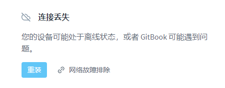

# 🌟 开始

### 前言


如果你在访问其它页面时出现此错误，点击重试按钮即可，是正常的。


<figure><figcaption>
Gitbook 连接丢失错误
</figcaption></figure>


灵工艺系列项目文档已迁移至此，如果遇到一些老软件的历史遗留问题，可以尝试访问下方的老文档门户站来查找解决方案。





同时，新文档已开放编辑权限，如参与编辑，可以点击下方的超链接提交更新。




### 快速访问项目文档

以发布顺序倒序排序。

<table data-view="cards"><thead><tr><th></th><th></th><th data-hidden data-card-cover data-type="files"></th><th data-hidden data-card-target data-type="content-ref"></th></tr></thead><tbody><tr><td><strong>局域网探测</strong></td><td>LanTest</td><td><a href=".gitbook/assets/CardCover_Default_400x300.png">CardCover_Default_400x300.png</a></td><td><a href="software/lantest/">lantest</a></td></tr><tr><td><strong>我的世界基岩开服器</strong></td><td>Minecraft Bedrock Server</td><td><a href=".gitbook/assets/CardCover_minecraft-bedrock-server_400x300.png">CardCover_minecraft-bedrock-server_400x300.png</a></td><td><a href="tutorial/minecraft-bedrock-server.md">minecraft-bedrock-server.md</a></td></tr><tr><td><strong>星穹之匙</strong></td><td>The key of Star Rail</td><td><a href=".gitbook/assets/CardCover_Default_400x300.png">CardCover_Default_400x300.png</a></td><td><a href="software/the-key-of-star-rail/">the-key-of-star-rail</a></td></tr><tr><td><strong>提瓦特之匙</strong></td><td>The Key of Teyvat</td><td><a href=".gitbook/assets/CardCover_Default_400x300.png">CardCover_Default_400x300.png</a></td><td><a href="software/the-key-of-teyvat/">the-key-of-teyvat</a></td></tr><tr><td><strong>网上邻居</strong></td><td>A n2n GUI</td><td><a href=".gitbook/assets/CardCover_n2n_400x300.png">CardCover_n2n_400x300.png</a></td><td><a href="software/n2n/">n2n</a></td></tr><tr><td><strong>泰拉瑞亚开服器</strong></td><td>Terraria Server</td><td><a href=".gitbook/assets/CardLogo_terraria-server_400x300.png">CardLogo_terraria-server_400x300.png</a></td><td><a href="software/terraria-server/">terraria-server</a></td></tr><tr><td><strong>音频模拟器</strong></td><td>Audio Emulators</td><td><a href=".gitbook/assets/CardCover_Default_400x300.png">CardCover_Default_400x300.png</a></td><td><a href="software/audio-emulators/">audio-emulators</a></td></tr><tr><td><strong>腐蚀控制台</strong></td><td>Rust Console</td><td><a href=".gitbook/assets/CardCover_rust-console_400x300.png">CardCover_rust-console_400x300.png</a></td><td><a href="software/rust-console/">rust-console</a></td></tr><tr><td><strong>我的世界Forge安装器</strong></td><td>Minecraft Forge Installer</td><td><a href=".gitbook/assets/CardCover_forge-installer_400x300.png">CardCover_forge-installer_400x300.png</a></td><td><a href="software/forge-installer/">forge-installer</a></td></tr><tr><td><strong>功能键通知</strong></td><td>Function Key Notice</td><td><a href=".gitbook/assets/CardCover_Default_400x300.png">CardCover_Default_400x300.png</a></td><td><a href="software/function-key-notice/">function-key-notice</a></td></tr><tr><td><strong>哈希</strong></td><td>Hash</td><td><a href=".gitbook/assets/CardCover_Default_400x300.png">CardCover_Default_400x300.png</a></td><td><a href="software/hash/">hash</a></td></tr><tr><td><strong>我的世界皮肤查看器</strong></td><td>Minecraft Skin Viewer</td><td><a href=".gitbook/assets/CardCover_minecraft-skin-viewer_400x300.png">CardCover_minecraft-skin-viewer_400x300.png</a></td><td><a href="software/minecraft-skin-viewer/">minecraft-skin-viewer</a></td></tr><tr><td><strong>我的世界模组更新器</strong></td><td>Minecraft Mods Updater</td><td><a href=".gitbook/assets/CardCover_minecraft-mods-updater_400x300.png">CardCover_minecraft-mods-updater_400x300.png</a></td><td><a href="software/minecraft-mods-updater/">minecraft-mods-updater</a></td></tr><tr><td><strong>未转变者开服器</strong></td><td>Unturned Server</td><td><a href=".gitbook/assets/CardCover_unturned-server_400x300.png">CardCover_unturned-server_400x300.png</a></td><td><a href="software/unturned-server/">unturned-server</a></td></tr><tr><td><strong>我的世界开服器</strong></td><td>Minecraft Server</td><td><a href=".gitbook/assets/CardCover_minecraft-server_400x300.png">CardCover_minecraft-server_400x300.png</a></td><td><a href="software/minecraft-server/">minecraft-server</a></td></tr></tbody></table>
