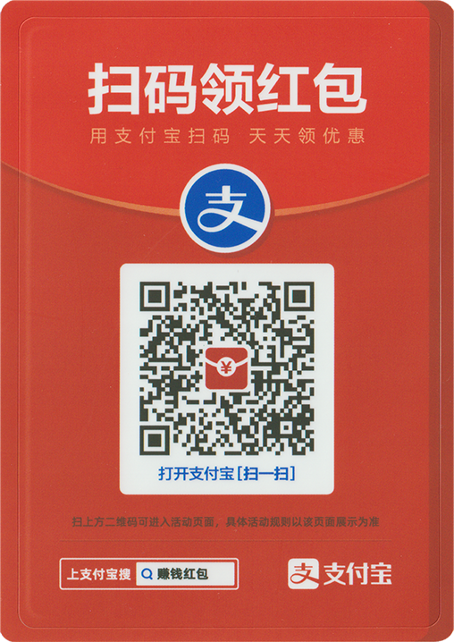

# 🗃️ 捐助支持

## 前言

灵工艺是一个公益/免费性质的软件开发工作室，致力于开发免费服务软件，由于工作室有开发成本与服务器成本,我们在努力降低这个问题，如果您喜欢我们开发的软件或者软件对你有帮助,您可以选择捐助我们

### 赞助者勋章 

为了表达您对我们的支持，灵工艺社区会为您发放 **赞助者** 的身份标识([查看勋章佩戴后个人主页样式](https://nullcraft.org/u/NullCraft))

捐助后请通过 [联系我们](../contact.md) 页面的联系方式与 快辰 进行联系为您发放勋章，由于勋章发放在灵工艺社区上，需要您先行 [完成注册](https://nullcraft.org/) 并验证账户后提供 **个人主页**$$^1$$ 网址才能进行正确添加，不然我们无法知道谁是您。


**我们无法变更的内容：**

因第三方捐助平台：爱发电单次支持最低限额设置为 5¥$$^2$$，故其它方式捐助支持的小伙伴发放勋章需要以爱发电平台为最底限额进行发放


**(1).**&#x4E2A;人账户ID是注册灵工艺社区后你的个人的唯一标识名称。

**个人账户地址获取方法:**

1. 注册并验证邮箱后登录[灵工艺社区](https://nullcraft.org/)
2. 点击右上角的个人 `头像|名字`
3. 在弹出菜单中选择 `个人主页`
4. 打开后将此页面的地址链接复制并发送给快辰

**(2).**&#x7231;发电平台最低设置捐赠额为 `5¥` 为了与其他赞助者公平获得，以此作为最低发放额。

## 捐助方案 

### 通过支付平台进行捐助


如果下方二维码图片加载失败可 [点击此处](https://pujipuji.com/) 打开页面


<figure><figcaption>
微信 | 支付宝 | QQ 统一收款名称：快辰
</figcaption></figure>

### 通过活动进行支持

<figure><figcaption></figcaption></figure>

## 捐助列表 

### 今年(2026🐴)的捐助列表 


当前列表更新时间 2026-01-01 00:00


| 日期(2026) | 名称 | 金额(¥) | 捐助者留言 | 我的回复 |
| -------- | -- | ----- | ----- | ---- |
|          |    |       |       |      |

### 已归档的捐助列表明细 


因为捐助列表经过多年累积导致页面较大，加载过慢，自2023年起，每年的最后一天将整理归档为单独的子页面。

可点击下方卡片快速查看捐助列表，再次感谢您支持灵工艺。



[2025.md](2025.md)



[2024.md](2024.md)



[2023.md](2023.md)



[2022.md](2022.md)



[2021.md](2021.md)



[2019.md](2019.md)



[2018.md](2018.md)



[2017.md](2017.md)



[2016.md](2016.md)



[2015.md](2015.md)



[2014.md](2014.md)

