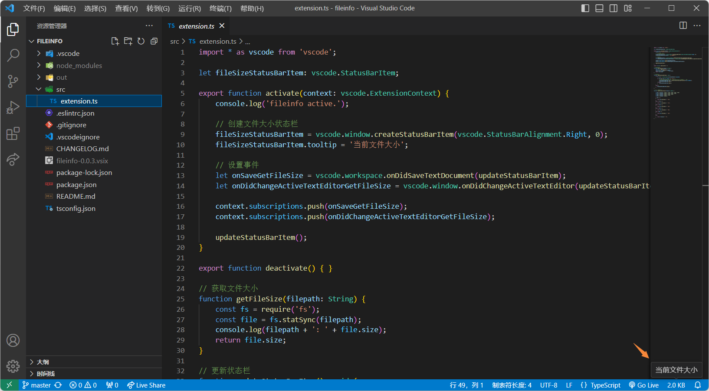
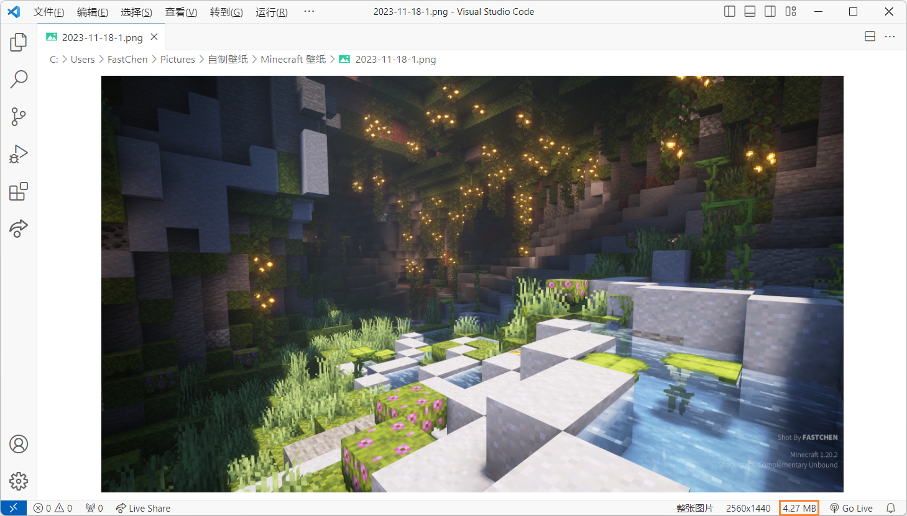

# Fileinfo \[VSCode]



## Fileinfo - 一个 VSCode 插件

目前它可以显示二进制文件信息。

### Use / 使用

安装它或者在 VSCode 拓展中搜索 fileinfo 安装即可启用

### Features / 功能

一个练手的项目， 它可以在右下角底部状态栏中显示当前打开的二进制文件的大小(KB)。

### Download / 下载

* **`[👍]`** VSCode 插件市场 中 搜索 `FastChen.fileinfo` 安装，可以自动同步更新
* 手动下载文件安装 [FastChen.fileinfo - VSCode Marketplace](https://marketplace.visualstudio.com/items?itemName=FastChen.fileinfo)
* 前往 [Github Releases](https://github.com/FastChen/vscode-fileinfo/releases) 下载

### Need Update / 计划更新

* [x] 显示文件的大小 `v0.0.1.728`
* [x] 根据大小自动切换文件进制格式 (KB、MB、GB、TB...) `v0.0.2.1111`
* [ ] 自定义配置位置 (状态栏的左右？)
* [ ] 根据不同文件有更详细的文件信息显示！
* [ ] 一些配置功能？

### Image / 一些图片

<figure><figcaption></figcaption></figure>

<figure><figcaption></figcaption></figure>

**😊 Enjoy!**
