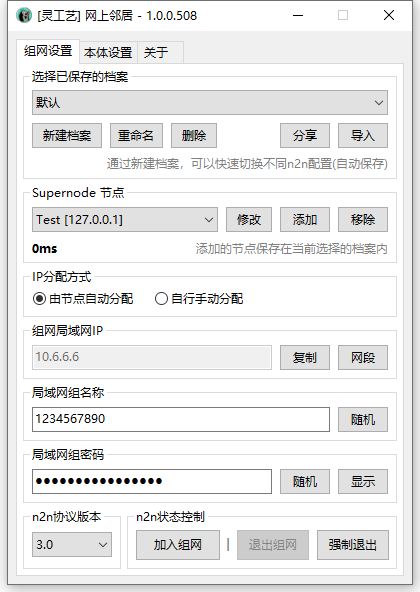

# 网上邻居


现在已发布 3.0 版本，可加入 [用户群](https://jq.qq.com/?_wv=1027\&k=A9YzWvbS) 下载体验。



```csharp
Software software = new Software();
software.Name = "网上邻居";
software.ProjectID = "2n2n";
software.Release = "https://nullcraft.org/d/39";
software.ReleaseDate = DateTime.Parse("2021,10,14").ToString();
software.Language = new string[] { "简体中文" };
software.Program = "C#";
software.Framework = ".NET8";

NullCraftSoftwareList.add(software);

Console.WriteLine(NullCraftSoftwareList.Items.Conut());

>>> 13
```


## 关于《网上邻居》

### 下载《网上邻居》



### 了解《网上邻居》


[introduction.md](introduction.md)


### 快速上手


[tutorial.md](tutorial.md)


### 查看更新日志


[update.md](update.md)


### 软件图片

<figure><figcaption><p>网上邻居 - 组网设置</p></figcaption></figure>
