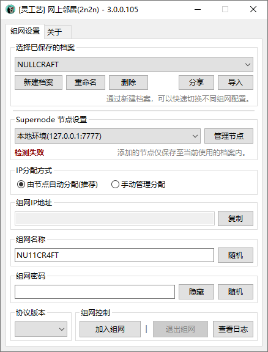
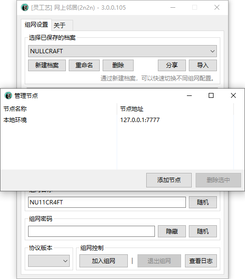
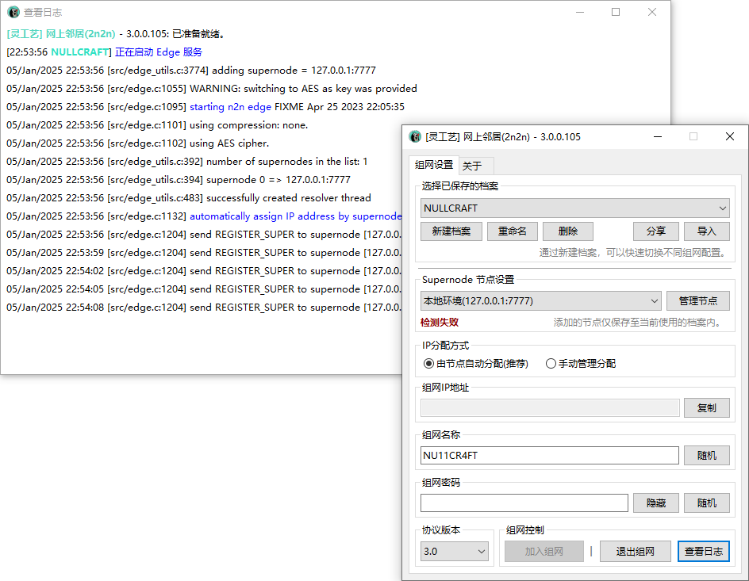
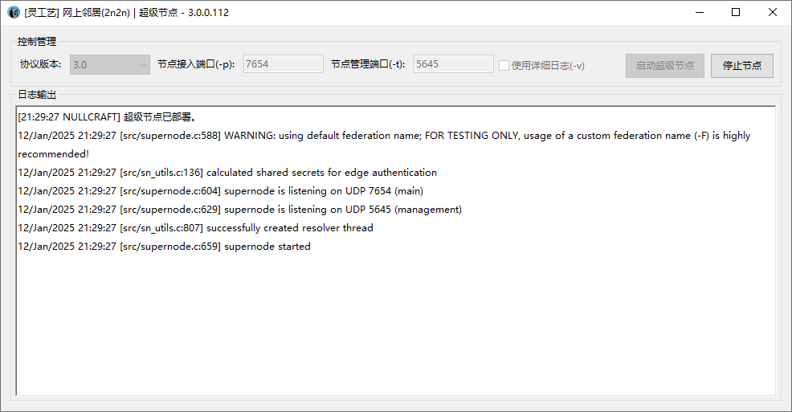

# 网上邻居


现在已发布 3.0 版本，可加入 [用户群](https://jq.qq.com/?_wv=1027\&k=A9YzWvbS) 下载体验。



```csharp
Software software = new Software();
software.Name = "网上邻居";
software.ProjectID = "2n2n";
software.Release = "https://nullcraft.org/d/39";
software.ReleaseDate = DateTime.Parse("2021,10,14").ToString();
software.Language = new string[] { "简体中文" };
software.Program = "C#";
software.Framework = ".NET8";

NullCraftSoftwareList.add(software);

Console.WriteLine(NullCraftSoftwareList.Items.Conut());

>>> 13
```


## 关于《网上邻居》

### 下载《网上邻居》


访问灵工艺社区进行下载


## 软件介绍

### 什么是 n2n?

这个软件就是由 [ntop](https://github.com/ntop/n2n) 创建的项目，可以通过 p2p 技术来对两个或多个异地的互联网打洞成为一个一个虚拟网段下实现的组网。

### 什么是 网上邻居(2n2n)？

灵工艺网上邻居(2n2n 是 NullCraft n2n 的简写)，是以 n2n 围绕开发的一款 GUI 的 n2n 可视化配置管理工具，比起在 Windows 上使用命令行更方便、对小白更友好。同时还能快速配置与管理。


网上邻居这个名字难道不是很贴切吗 ( ͡• ͜ʖ ͡• )


**其中开发提供:**

* 2n2n edge 可视化 GUI 即 Client(客户端)
* 2n2n supernode 可视化 GUI 即 Server(服务端)

### 为什么制作此工具?

为了方便实现计算机与计算机之间在互联网下的局域网组网，可以延申多种使用场景，像最简单的局域网联机游戏。

### 有什么优势?

如果对称组网成功，那么你将会获得一个非常友好的网络环境，通常在这里使用游戏联机延迟不会很高。

### 我需要有什么?

如果双方网络环境都很好，只需要一台小水管带宽(1m)的服务器作为打洞握手的超级节点即可。这成本基本可以忽略不计，不需要多少性能，也不需要多少内存。 因此你可以随便去找价格最低配置最差的一台小服务器就能实现低延迟组网。

### 为什么需要节点?你不能提供吗?

n2n组网是需要使用中间人超级节点(supernode)的，我暂时不会提供公益的超级节点，因为灵工艺一直在一非常低的预算进行正常活动。我们会减少一些不必要的支出。


如果你想要赞助节点/资金，那么也非常欢迎，你可以到 [用户群](https://jq.qq.com/?_wv=1027\&k=A9YzWvbS) 内联系@快辰或通过 [捐助支持](https://docs.nullcraft.org/donate) 进行赞助。&#x20;

因此有公益节点后，将会在此提供公益档案的分享。


### 快速上手


[tutorial.md](tutorial.md)


### 查看更新日志


[update.md](update.md)


### 软件图片

<figure><figcaption><p>网上邻居(2n2n) - 主界面</p></figcaption></figure>

<figure><figcaption><p>网上邻居(2n2n) - 节点管理</p></figcaption></figure>

<figure><figcaption><p>网上邻居(2n2n) - 查看日志</p></figcaption></figure>

<figure><figcaption><p>网上邻居(2n2n) - 超级节点</p></figcaption></figure>
