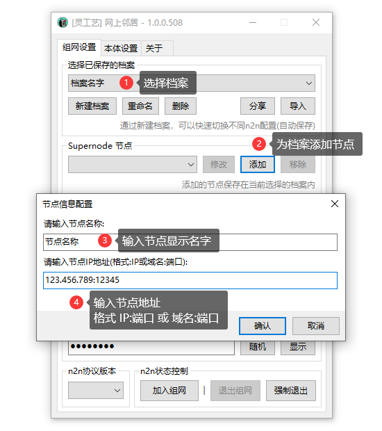
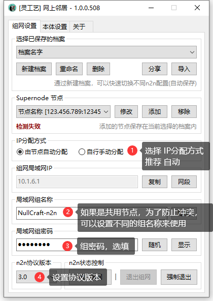

# 快速上手


此流程为 **2.x** 版本流程，**3.x** 基于此版本制作，部分仅作逻辑优化，流程基本一致。\
**将在后续更新 3.x 版本教学。**


## 下载



## 创建组网档案

### 新建档案

<figure><figcaption></figcaption></figure>

### 为档案添加节点

<figure><figcaption></figcaption></figure>

### 配置档案局域网设置

<figure><figcaption></figcaption></figure>

