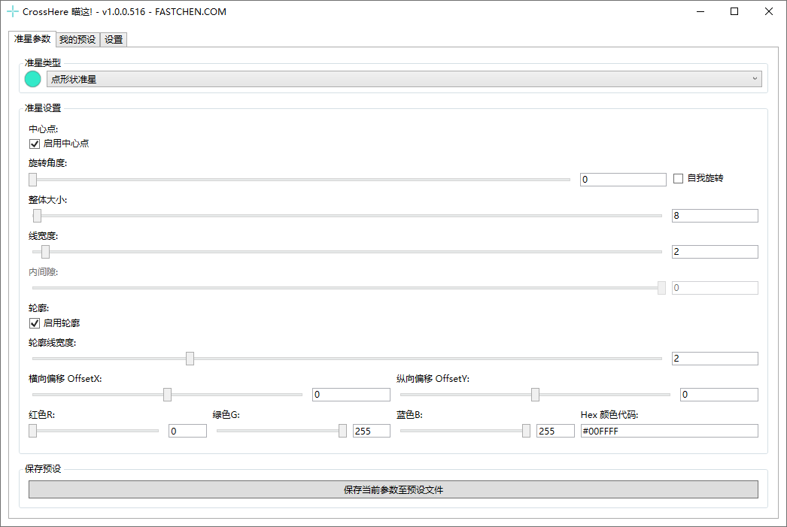
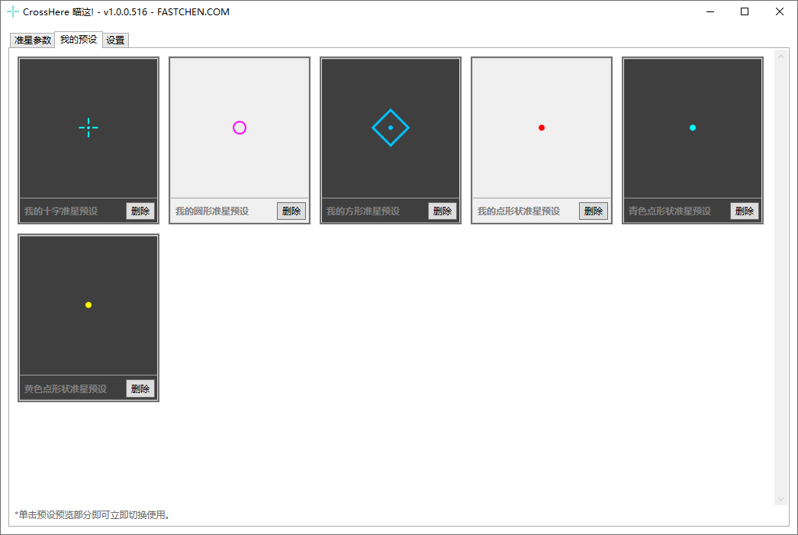
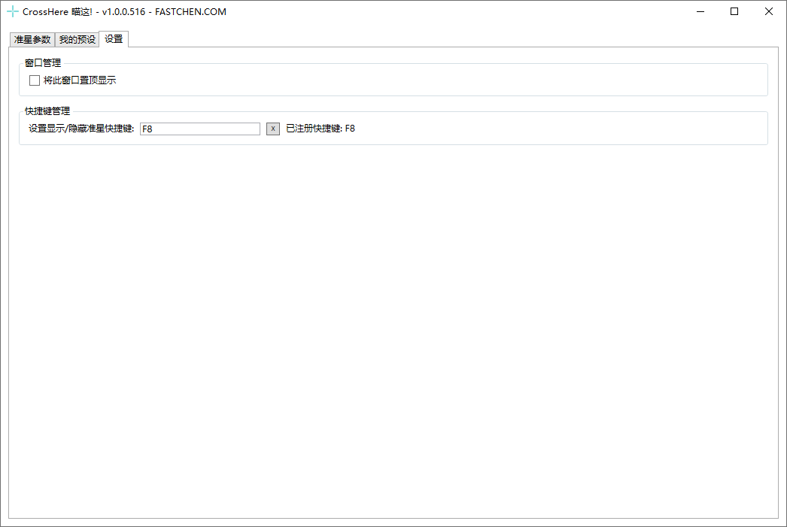

# 瞄这!


```csharp
Software software = new Software();
software.Name = "瞄这!";
software.ProjectID = "CrossHere!";
software.Release = "软件发布地址";
software.ReleaseDate = DateTime.Parse("2025,05,16").ToString();
software.Language = new string[] { "简体中文" };
software.Program = "C#";
software.Framework = ".NET8";

NullCraftSoftwareList.add(software);

Trace.WriteLine(NullCraftSoftwareList.Items.Conut());

>>> 26
```


## 关于《瞄这!》

### 下载《瞄这!》



### 软件介绍

一个可根据模板自定义参数的简单外置准星工具。

目前可自定义的参数：

* 是否显示中心点
* 准星旋转角度
* 准星自我旋转(0-360°的动态旋转)
* 准星整体的大小(以主屏幕宽高为最大上限)
* 准星线宽度
* 准星内间隙(仅部分形状支持)
* 是否显示轮廓线
* 准星轮廓线宽度
* 准星横向、纵向偏移
* 准星颜色

**目前支持以下几种准星形状：**

* 十字准星
* 点形状准星
* 圆形准星
* 方形准星

**后续更新方向：**

* [ ] 自定义准星(图片、路径方案)

### 更新日志


[update.md](update.md)


### 软件图片

<figure><figcaption><p>瞄这! - 准星参数</p></figcaption></figure>

<figure><figcaption><p>瞄这! - 我的预设</p></figcaption></figure>

<figure><figcaption><p>瞄这! - 设置</p></figcaption></figure>
