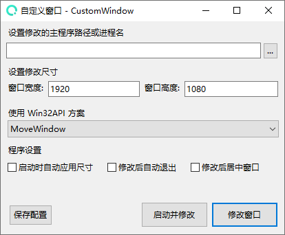

# 自定义窗口


此工具已开源发布





```csharp
Software software = new Software();
software.Name = "自定义窗口";
software.ProjectID = "CustomWindow";
software.Release = "https://nullcraft.org/d/100";
software.ReleaseDate = DateTime.Parse("2024,12,09").ToString();
software.Language = new string[] { "简体中文" };
software.Program = "C#";
software.Framework = ".NET8";

NullCraftSoftwareList.add(software);

Trace.WriteLine(NullCraftSoftwareList.Items.Conut());

>>> 23
```


## 关于《自定义窗口》 <a href="#guan-yu-mo-zu-jia-zai-qi-zhong-xin" id="guan-yu-mo-zu-jia-zai-qi-zhong-xin"></a>

### 下载《自定义窗口》 <a href="#xia-zai-mo-zu-jia-zai-qi-zhong-xin" id="xia-zai-mo-zu-jia-zai-qi-zhong-xin"></a>



### 软件介绍 <a href="#jie-shao-yu-shi-yong" id="jie-shao-yu-shi-yong"></a>

通过调用 Windows API(Win32API) `MoveWindow`、`SetWindowPos` 实现对窗口句柄发送更新窗口位置、尺寸从而更改窗口的状态。

**了解更多API:**

* 全部 [Windows API 索引](https://learn.microsoft.com/zh-cn/windows/win32/apiindex/windows-api-list)
* 了解 [MoveWindow](https://learn.microsoft.com/zh-cn/windows/win32/api/winuser/nf-winuser-movewindow)
* 了解 [SetWindowPos](https://learn.microsoft.com/zh-cn/windows/win32/api/winuser/nf-winuser-setwindowpos)

### 使用教学 <a href="#jie-shao-yu-shi-yong" id="jie-shao-yu-shi-yong"></a>


使用本工具需要先安装 [.NET8](https://dotnet.microsoft.com/zh-cn/download/dotnet/8.0) 桌面运行环境。


**视频教学：** [点此前往查看视频](https://www.bilibili.com/video/BV1tTqcYmEMp/)

**文字教学：**

1. 运行工具
2. 选择程序路径或程序的进程名称
3. 设置一个尺寸
4. 点击 修改窗口按钮 测试是否修改成功

### 更新日志 <a href="#geng-xin-ri-zhi" id="geng-xin-ri-zhi"></a>


[update.md](update.md)


### 软件图片

<figure><figcaption></figcaption></figure>
