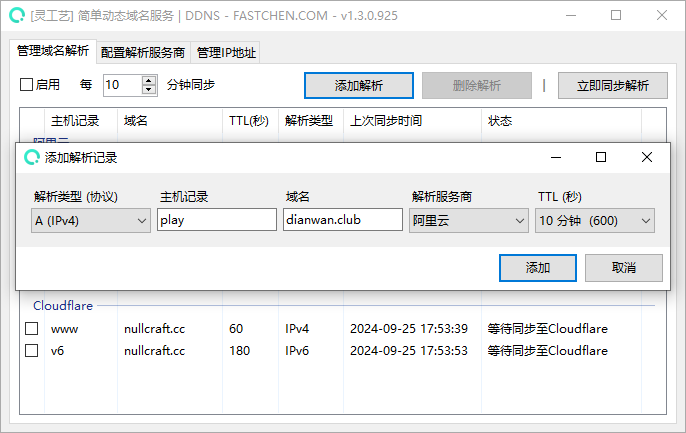
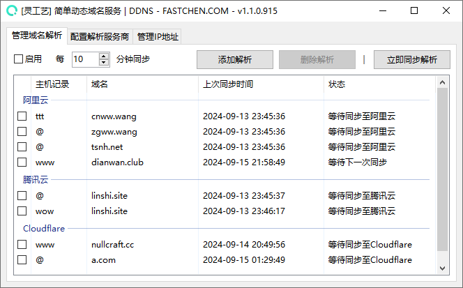

# 简单动态域名服务


```csharp
Software software = new Software();
software.Name = "简单动态域名服务";
software.ProjectID = "EasyDDNS";
software.Release = "https://nullcraft.org/d/97";
software.ReleaseDate = DateTime.Parse("2024,09,11").ToString();
software.Language = new string[] { "简体中文" };
software.Program = "C#";
software.Framework = ".NET8";

NullCraftSoftwareList.add(software);

Trace.WriteLine(NullCraftSoftwareList.Items.Conut());

>>> 22
```


## 关于《简单动态域名服务》 <a href="#guan-yu-mo-zu-jia-zai-qi-zhong-xin" id="guan-yu-mo-zu-jia-zai-qi-zhong-xin"></a>

### 下载《简单动态域名服务》 <a href="#xia-zai-mo-zu-jia-zai-qi-zhong-xin" id="xia-zai-mo-zu-jia-zai-qi-zhong-xin"></a>



### 软件介绍 <a href="#jie-shao-yu-shi-yong" id="jie-shao-yu-shi-yong"></a>

《简单动态域名服务》即《EasyDDNS》是一款易用的动态IP解析服务，可以将本机IP地址定时同步到域名服务商进行解析，实现域名始终指向最新的动态IP地址，以便方便通过固定域名访问动态IP服务。

### 使用教学 <a href="#jie-shao-yu-shi-yong" id="jie-shao-yu-shi-yong"></a>


[shi-yong-jiao-xue.md](shi-yong-jiao-xue.md)


### 更新日志 <a href="#geng-xin-ri-zhi" id="geng-xin-ri-zhi"></a>


[update.md](update.md)


### 软件图片 <a href="#ruan-jian-tu-pian" id="ruan-jian-tu-pian"></a>

<figure><figcaption></figcaption></figure>

<figure><figcaption></figcaption></figure>
