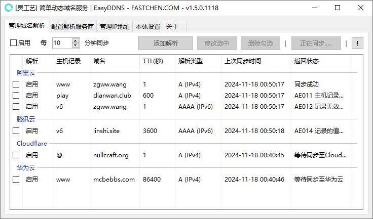

# 使用教学


使用对应域名服务商前需要前往创建 `ACCESS_KEY` 才能正常使用解析服务。


### 配置解析服务商

打开软件，前往 配置解析服务商 页面，选择一个服务商并且前往服务商获取 AccessKey 以便程序可对解析有权进行操作。

#### 各大服务商 AccessKey 获取地址：


目前大部分服务商都支持通过创建子账号的方式管理权限。

为了避免权限过大，可以通过创建子账户并仅分配域名解析相关权限。


* 前往 👉 [阿里云](https://ram.console.aliyun.com/manage/ak) 创建 AccessKey

创建好 AccessKey 后，将 ACCESS\_KEY\_ID(账户) 以及 ACCESS\_KEY\_SECRET(密钥) 填入对应文本框内即可。

### 添加域名并解析


在添加域名解析时先自行在对应的服务商内手动添加 **A 记录 解析**，目前为了防止滥用API封禁，软件不会自动检查并创建，仅做修改。


例如，我在 `dianwan.club` 这个域名下，希望通过访问 `dianwan.club` 这个域名指向我的IP地址。

则在 **主机记录** 内填写 **@** 即可，因为 记录值 会随着软件进行同步，创建时填写随意IP地址即可。

当然如果你希望通过 `www.dianwan.club` 或者其它 `任意前缀.dianwan.club` 则在主机记录内填写 `www` 或 `任意对应前缀` 即可。

<figure><figcaption></figcaption></figure>

在服务商手动添加完解析后，前往 《简单动态域名服务》 中的 **管理域名解析** 页面 点击 **添加解析** 按钮，填写对应的 **主机记录**、**域名** 和 **服务商** 即可。

<figure><figcaption>
添加新的解析
</figcaption></figure>

添加后，点击 **立即同步** 按钮可以快速同步一次，也可以 **勾选启用** 并配置循环同步时间即可(单位：分钟)

<figure><figcaption>
正在进行同步
</figcaption></figure>


在软件使用上遇到问题或提交更新建议，可以前往 [**灵工艺社区**](https://nullcraft.org/d/56) 或 [**用户群**](https://jq.qq.com/?\_wv=1027\&k=A9YzWvbS) 进行提交。

