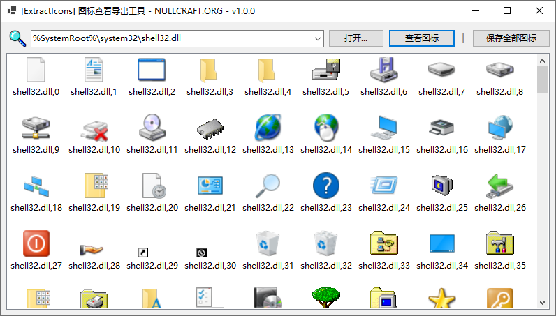

# 图标查看导出工具


```csharp
Software software = new Software();
software.Name = "图标查看导出工具";
software.ProjectID = "ExtractIcons";
software.Release = "https://nullcraft.org/d/96";
software.ReleaseDate = DateTime.Parse("2024,08,28").ToString();
software.Language = new string[] { "简体中文" };
software.Program = "C#";
software.Framework = ".NET8";

NullCraftSoftwareList.add(software);

Trace.WriteLine(NullCraftSoftwareList.Items.Conut());

>>> 21
```


## 关于《图标查看导出工具》 <a href="#guan-yu-mo-zu-jia-zai-qi-zhong-xin" id="guan-yu-mo-zu-jia-zai-qi-zhong-xin"></a>

### 下载《图标查看导出工具》 <a href="#xia-zai-mo-zu-jia-zai-qi-zhong-xin" id="xia-zai-mo-zu-jia-zai-qi-zhong-xin"></a>



### 介绍与使用 <a href="#jie-shao-yu-shi-yong" id="jie-shao-yu-shi-yong"></a>

通过点击 `打开...` 按钮选择要提取图标的文件，然后单击 `查看图标` 按钮进行预览图标，点击 `保存全部图标` 按钮可以导出图标文件。

<figure><figcaption></figcaption></figure>

### 更新日志 <a href="#geng-xin-ri-zhi" id="geng-xin-ri-zhi"></a>


[update.md](update.md)


### 软件图片 <a href="#ruan-jian-tu-pian" id="ruan-jian-tu-pian"></a>

<figure><figcaption></figcaption></figure>
