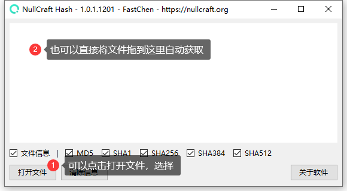

# 哈希


一个用于验证文件哈希(Hash)的小工具



```csharp
Software software = new Software();
software.Name = "哈希";
software.ProjectID = "Hash";
software.Release = "https://nullcraft.org/d/12";
software.ReleaseDate = DateTime.Parse("2020,12,25").ToString();
software.Language = new string[] { "简体中文" };
software.Program = "C#";
software.Framework = ".NET3.0";

NullCraftSoftwareList.add(software);

Console.WriteLine(NullCraftSoftwareList.Items.Conut());

>>> 7
```


## 关于《哈希》

### 下载《哈希》



### 哈希的使用教程


[tutorial.md](tutorial.md)


### 查看更新日志


[update.md](update.md)


### 软件图片

<figure><figcaption><p>哈希 - 主界面 (查看文件状态)</p></figcaption></figure>
