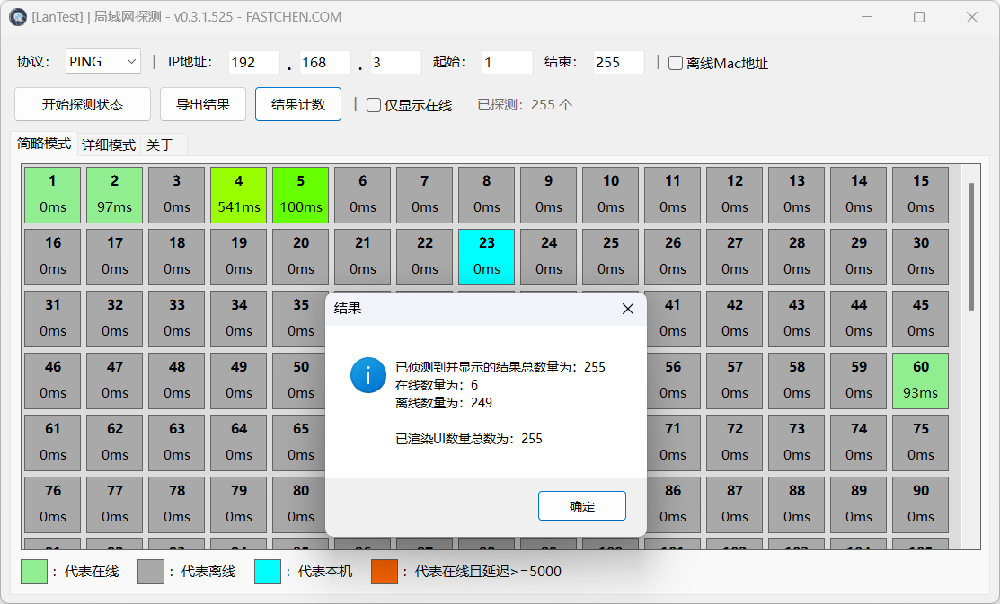

# 局域网探测


**此工具处于 BETA 持续开发阶段。**

如遇到任何错误，请通过 [用户群](https://jq.qq.com/?\_wv=1027\&k=A9YzWvbS) 或 [灵工艺社区](https://nullcraft.org/t/feedback) 进行反馈。



```csharp
Software software = new Software();
software.Name = "局域网探测";
software.ProjectID = "LanTest";
software.Release = "https://nullcraft.org/d/79";
software.ReleaseDate = DateTime.Parse("2023,12,13").ToString();
software.Language = new string[] { "简体中文" };
software.Program = "C#";
software.Framework = ".NET7";

NullCraftSoftwareList.add(software);

Trace.WriteLine(NullCraftSoftwareList.Items.Conut());

>>> 18
```


## 关于《局域网探测》

### 简单介绍

一款用于可视化显示局域网 IP 使用状态的软件。

### 下载《局域网探测》



### 使用教学


[tutorial.md](tutorial.md)


### 更新日志


[update.md](update.md)


### 软件图片

<figure><figcaption><p>局域网探测 - 主界面 (简略模式)</p></figcaption></figure>

<figure><figcaption><p>局域网探测 - 主界面 (详细模式)</p></figcaption></figure>
