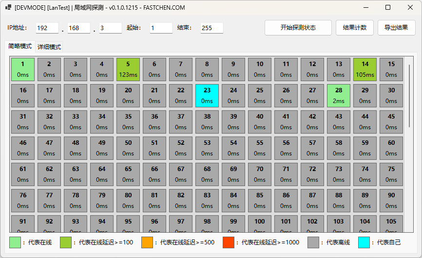
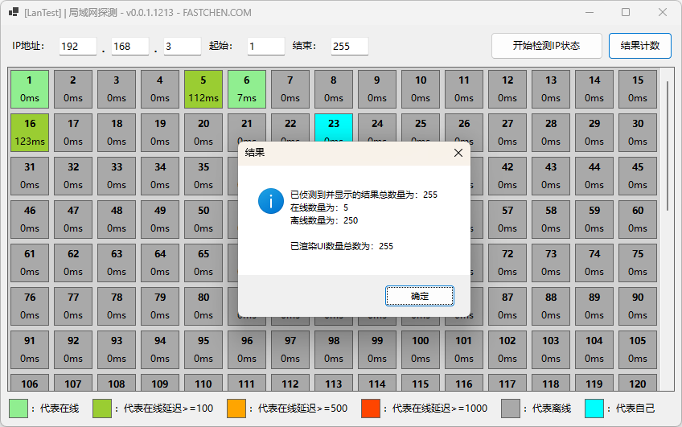

# 使用教学

运行软件后，在 **IP地址** 处填写要测试的 **前三段IP地址**，在 **起始** 处填写第四段开始数，在 **结束** 处填写第四段结束数，然后点击 **开始检测IP状态** 按钮，并坐和放宽。

<figure><figcaption>
扫描后结果
</figcaption></figure>

扫描完毕后可以点击 结果计数 确认扫描数量与设置的数量一致，并快速查看在线数量。

<figure><figcaption></figcaption></figure>
