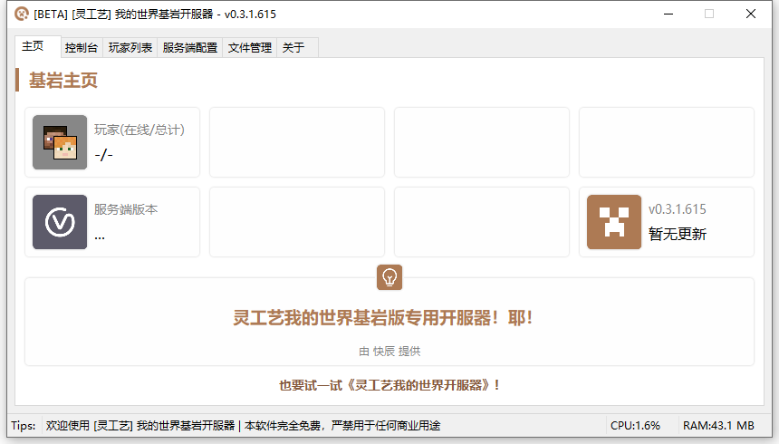
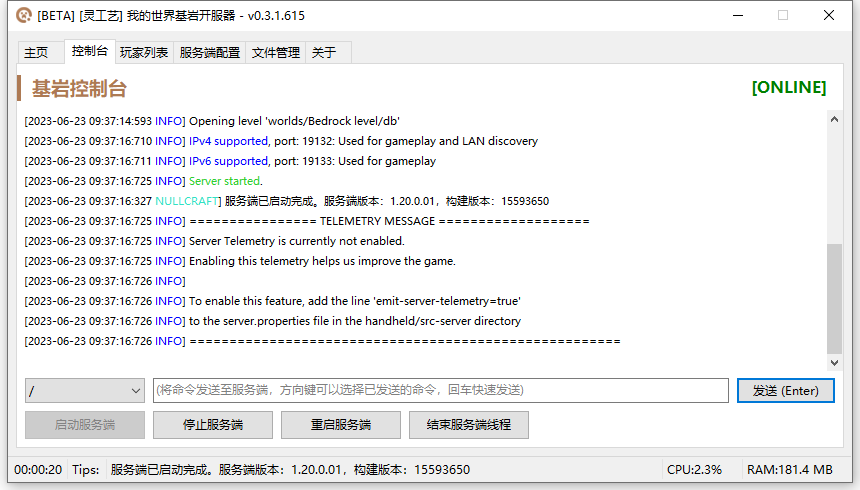
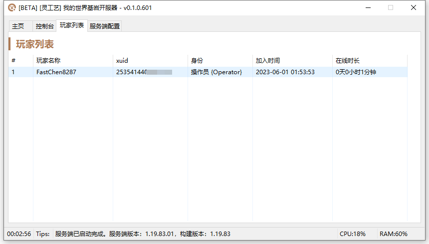
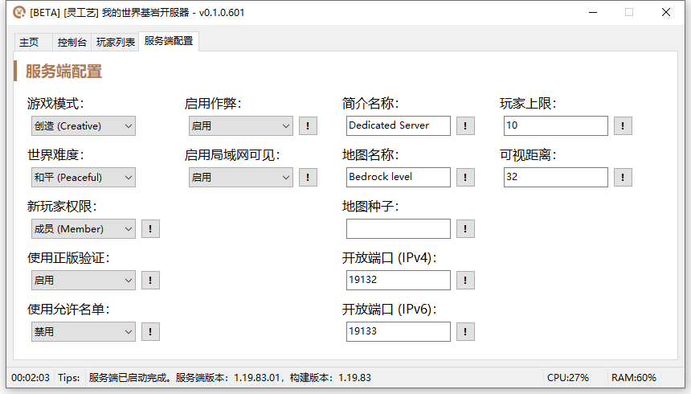
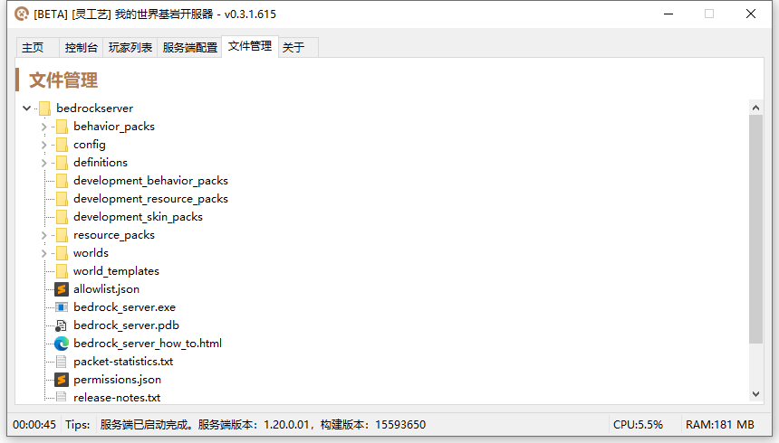

# 我的世界基岩开服器


**此工具处于 BETA 持续开发阶段。**

如遇到任何错误，请通过 [用户群](https://jq.qq.com/?_wv=1027\&k=A9YzWvbS) 或 [灵工艺社区](https://nullcraft.org/t/feedback) 进行反馈。


<pre class="language-csharp" data-title="Minecraft_Bedrock_Server.sln"><code class="lang-csharp">Software software = new Software();
software.Name = "我的世界基岩开服器";
software.ProjectID = "Minecraft Bedrock Server";
software.Release = "#";
software.ReleaseDate = DateTime.Parse("2023,6,01").ToString();
software.Language = new string[] { "简体中文" };
software.Program = "C#";
software.Framework = ".NET8";

NullCraftSoftwareList.add(software);

Trace.WriteLine(NullCraftSoftwareList.Items.Conut());

<strong>>>> 17
</strong></code></pre>

## 关于《我的世界基岩开服器》

### 下载《我的世界基岩开服器》



### 使用教学


[minecraft-bedrock-server.md](../../tutorial/minecraft-bedrock-server.md)


### 更新日志


[update.md](update.md)


### 软件图片

<figure><figcaption>
我的世界基岩开服器 - 主页
</figcaption></figure>

<figure><figcaption>
我的世界基岩开服器 - 控制台
</figcaption></figure>

<figure><figcaption>
我的世界基岩开服器 - 玩家列表
</figcaption></figure>

<figure><figcaption>
我的世界基岩开服器 - 服务端配置
</figcaption></figure>

<figure><figcaption>
我的世界基岩开服器 - 文件管理
</figcaption></figure>
