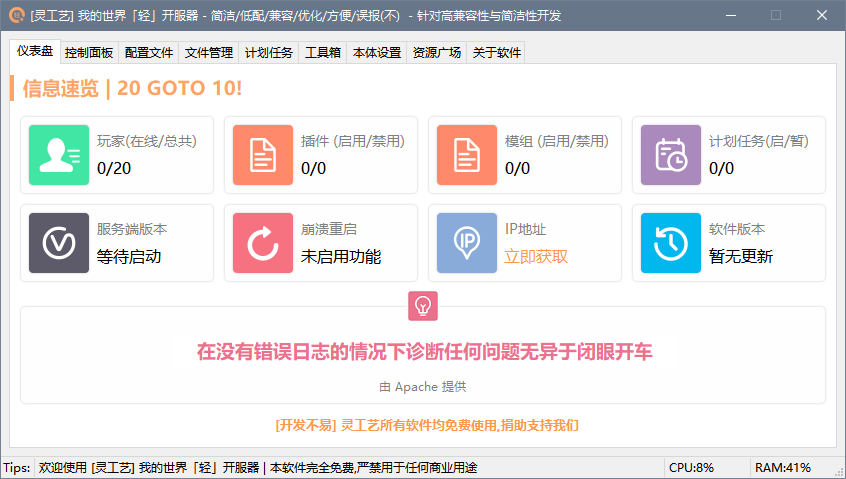
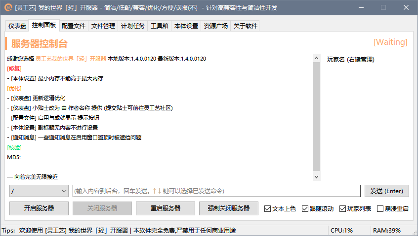
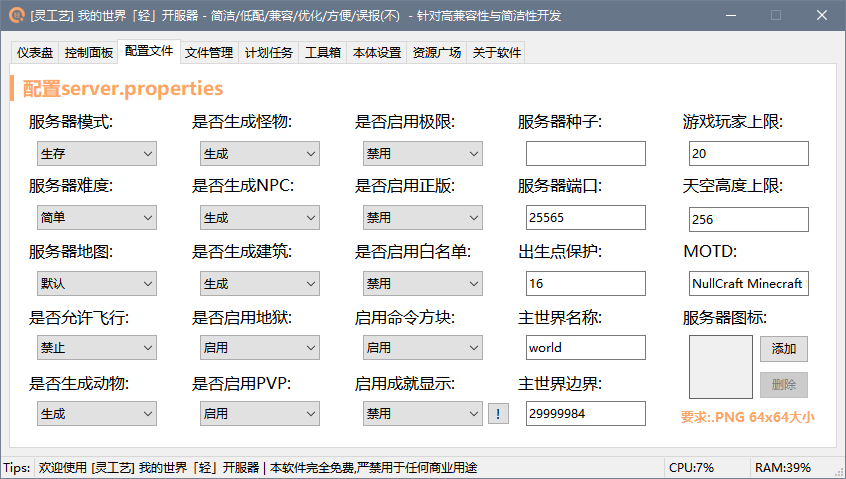
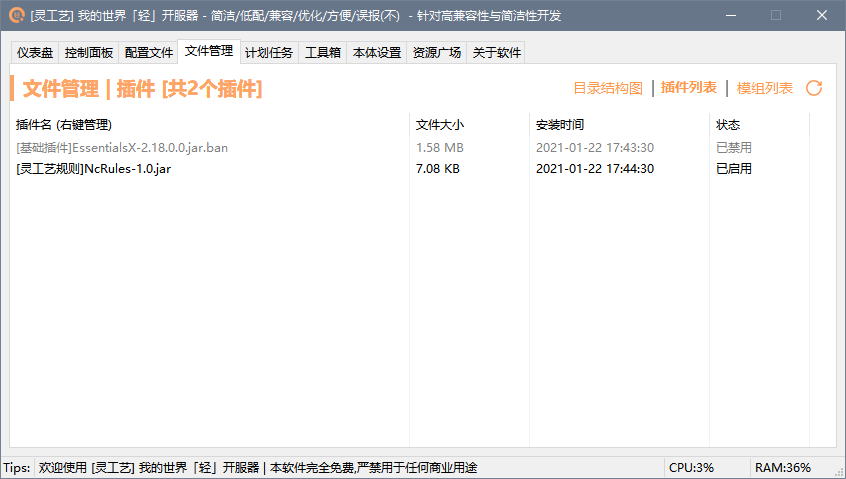
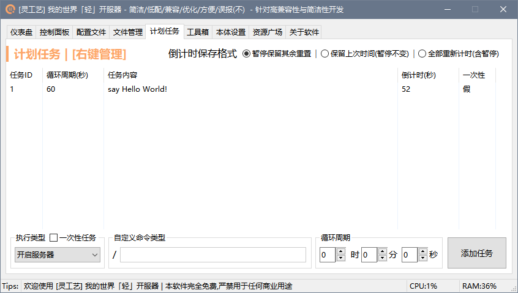
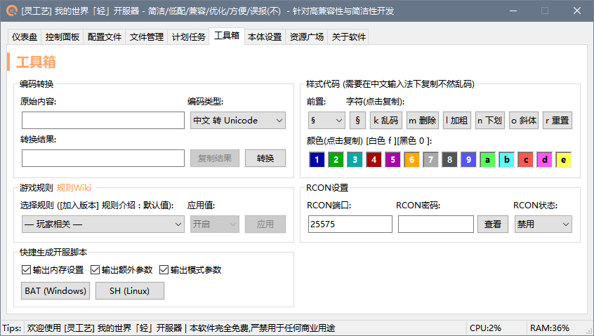
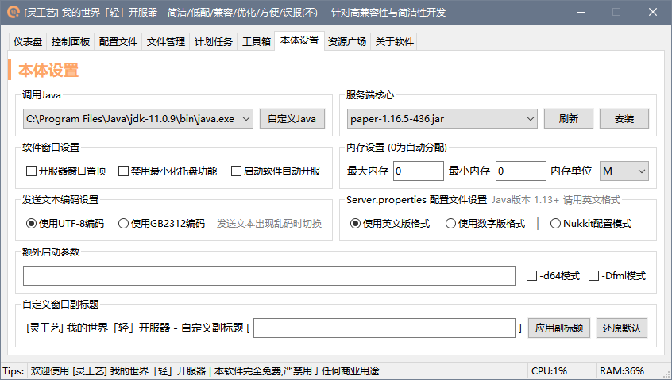
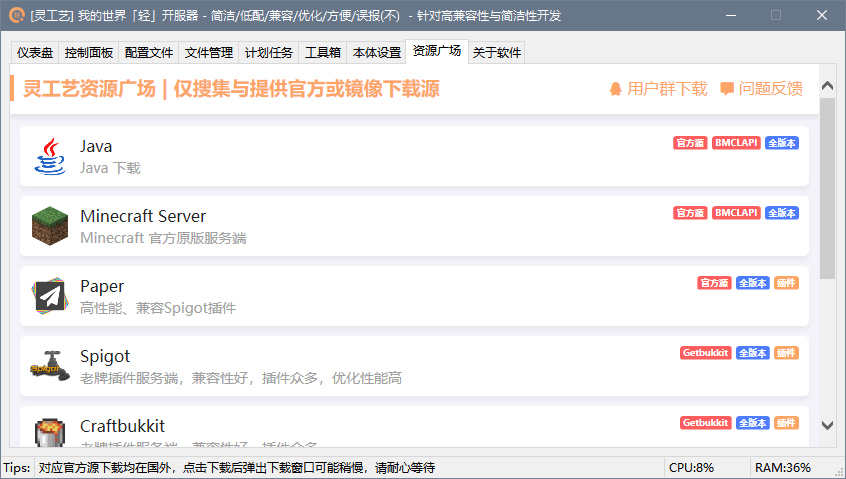

# 我的世界开服器


**此项目是《灵工艺》目前为《我的世界》开发的最新版开服工具。**

此工具的前身项目为：[灵工艺我的世界开服器Pro](../../outdated/minecraft-server-pro.md)，由于年代久远，编码可读性差，性能优化问题等废弃。

目前已替换为当前版本。


```csharp
Software software = new Software();
software.Name = "我的世界开服器";
software.ProjectID = "Minecraft Server";
software.Release = "https://nullcraft.org/d/4";
software.ReleaseDate = DateTime.Parse("2015,12,10").ToString();
software.Language = new string[] { "简体中文" };
software.Program = "C#";
software.Framework = ".NET4.8";

//NullCraftSoftwareList.add(software);
NullCraftSoftwareList[0] = software;

Console.WriteLine(NullCraftSoftwareList.Items.Conut());

>>> 1
```

## 关于《我的世界开服器》

### 下载《我的世界开服器》

#### 前往灵工艺官方下载：



#### 前往 MCBBS 论坛贴下载：



### 如果你想知道最近更新了什么


[update.md](update.md)


### 开服上的常见问题


[faq.md](faq.md)


### 软件图片

<figure><figcaption><p>我的世界开服器 - 主页</p></figcaption></figure>

<figure><figcaption><p>我的世界开服器 - 控制面板</p></figcaption></figure>

<figure><figcaption><p>我的世界开服器 - 配置文件</p></figcaption></figure>

<figure><figcaption><p>我的世界开服器 - 文件管理 (插件)</p></figcaption></figure>

<figure><figcaption><p>我的世界开服器 - 计划任务</p></figcaption></figure>

<figure><figcaption><p>我的世界开服器 - 工具箱</p></figcaption></figure>

<figure><figcaption><p>我的世界开服器 - 本体设置</p></figcaption></figure>

<figure><figcaption><p>我的世界开服器 - 资源广场</p></figcaption></figure>

## 版权声明

本工具版权归属开发者：快辰，由灵工艺发布，其他人不得使用本软件用于商业用途或声称这是你开发的软件。
