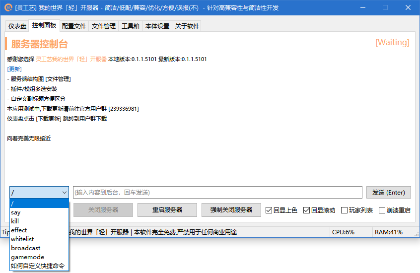
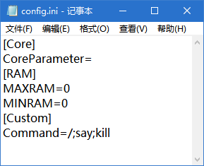

# 自定义功能

## 自定义快捷指令

如图所示，这里面的快捷命令不一定就是你需要的，那么如何去自定义它呢？

<figure><figcaption></figcaption></figure>

### **添加自定义指令**

**步骤如下**

1. 打开开服器所在文件夹下的 **`config.ini`**
2. 在文件最后一行回车，并添加 **`[Custom]`** 为独立一行
3. 再次回车开启新的一行并添加命令 **`Command=`**
4. 在 **`Command=`** 等号后面输入你要添加的命令 **但是有以下要求!**
   1. 开头必须由 **`/`** 开头
   2. 每个命令中间使用 **`;`** 分割

### 如需取消自定义快捷命令

**删除** **`Command=XXX`** **一行即可**

### 文件示例

<div align="left">

<figure><figcaption></figcaption></figure>

</div>

## 强制设置服务端状态

如果已确定服务端运行但开服器未正常读取到运行状态，可使用以下命令强制更新服务端状态

```
/nc serverisruning
```


为了保证服务端确实已运行，命令采用发送say命令判断服务端是否运行

