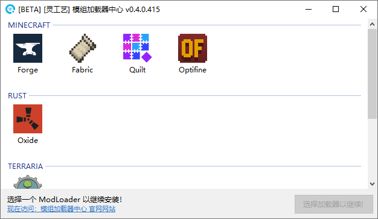
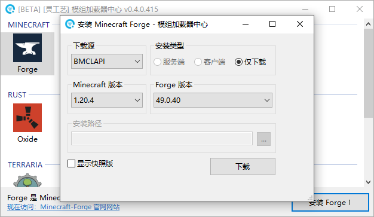
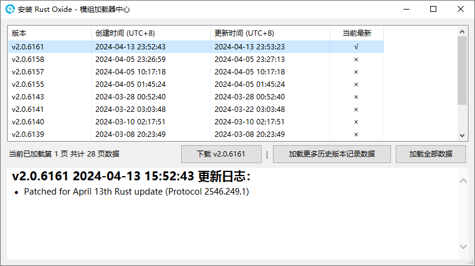

# 模组加载器中心


**此工具处于 BETA 持续开发阶段。**

如遇到任何错误，请通过 [用户群](https://jq.qq.com/?\_wv=1027\&k=A9YzWvbS) 或 [灵工艺社区](https://nullcraft.org/t/feedback) 进行反馈。



```csharp
Software software = new Software();
software.Name = "模组加载器中心";
software.ProjectID = "ModLoader Center";
software.Release = "https://nullcraft.org/d/87";
software.ReleaseDate = DateTime.Parse("2024,04,09").ToString();
software.Language = new string[] { "简体中文" };
software.Program = "C#";
software.Framework = ".NET8";

NullCraftSoftwareList.add(software);

Trace.WriteLine(NullCraftSoftwareList.Items.Conut());

>>> 20
```


## 关于《模组加载器中心》

### 下载《模组加载器中心》



### 介绍与使用


[introduction.md](introduction.md)


### 更新日志


[update.md](update.md)


### 软件图片

<figure><figcaption><p>主界面</p></figcaption></figure>

<figure><figcaption><p>Minecraft Forge</p></figcaption></figure>

<figure><figcaption><p>Minecraft Fabric</p></figcaption></figure>

<figure><figcaption><p>Minecraft Quilt</p></figcaption></figure>

<figure><figcaption><p>Minecraft Optifine</p></figcaption></figure>

<figure><figcaption><p>Rust Oxide</p></figcaption></figure>
