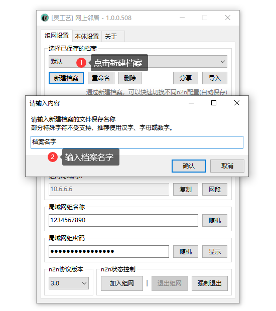
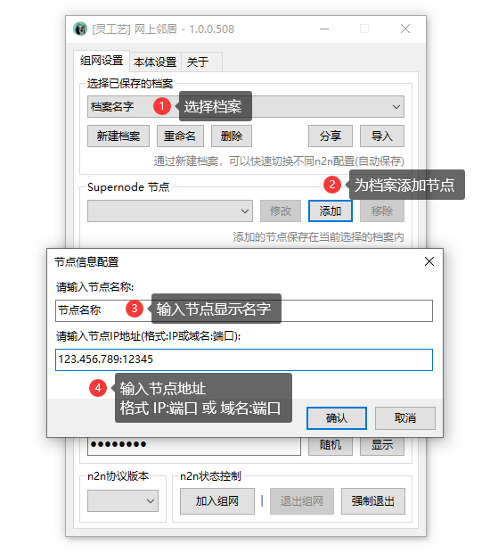

# 快速上手


此工具目前处于积极开发阶段，软件自身有任何问题请务必前往用户群进行反馈。


## 下载



## 创建组网档案

### 新建档案

<figure><figcaption></figcaption></figure>

### 为档案添加节点

<figure><figcaption></figcaption></figure>

### 配置档案局域网设置

<figure><figcaption></figcaption></figure>

