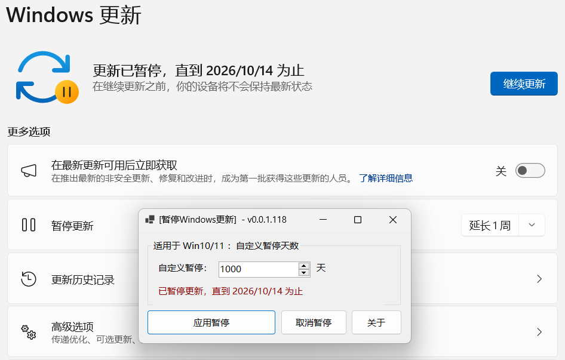
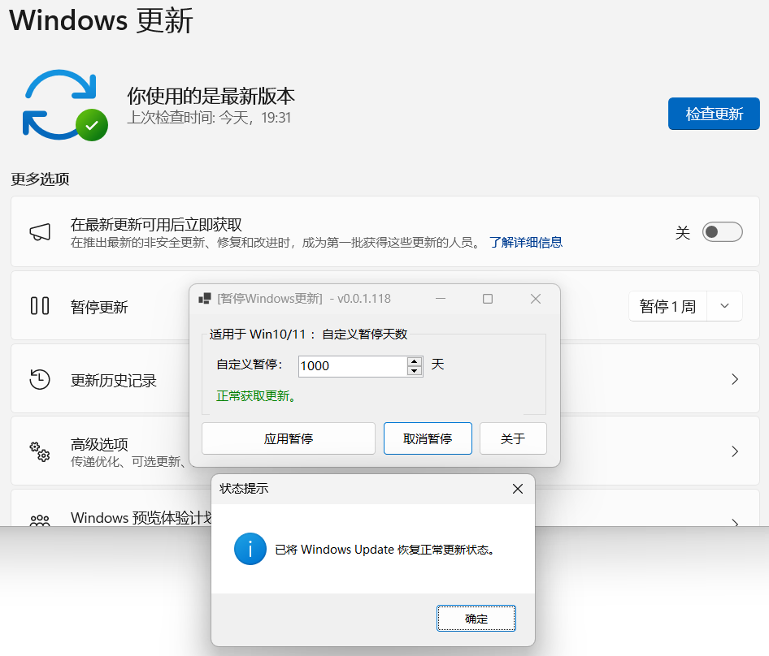

# 视窗系统更新暂停工具


此工具已开源发布。





```csharp
Software software = new Software();
software.Name = "Windows更新暂停工具";
software.ProjectID = "Pause Windows Update";
software.Release = "https://nullcraft.org/d/80";
software.ReleaseDate = DateTime.Parse("2024,01,18").ToString();
software.Language = new string[] { "简体中文" };
software.Program = "C#";
software.Framework = ".NET8";

NullCraftSoftwareList.add(software);

Trace.WriteLine(NullCraftSoftwareList.Items.Conut());

>>> 19
```


## 关于《视窗系统更新暂停工具》

### 简单介绍

一个可以快捷自定义 Windows 暂停更新天数的工具，实现基本永久的禁用更新。

同时不影响 Microsoft Store (微软商店) 与 Xbox 游戏服务的使用，以及随时可以再次获得更新。

### 下载《视窗系统更新暂停工具》



### 使用教学


[tutorial.md](tutorial.md)


### 软件图片

<figure><figcaption><p>软件主界面</p></figcaption></figure>

<figure><figcaption><p>启用暂停成功通知</p></figcaption></figure>

<figure><figcaption><p>确认暂停一致</p></figcaption></figure>

<figure><figcaption><p>取消暂停</p></figcaption></figure>

<figure><figcaption><p>不影响其它软件/服务</p></figcaption></figure>

## 此软件开源协议声明

本工具已开放源代码，并托管至 Github ，使用 [GNU General Public License v3.0](https://github.com/FastChen/Pause-Windows-Update?tab=GPL-3.0-1-ov-file#readme) 许可，对于源码的使用，请遵守协议许可的范围内使用。
