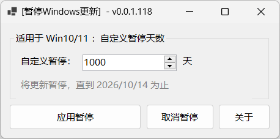
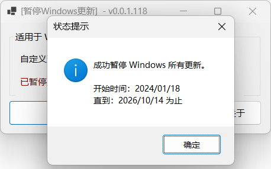
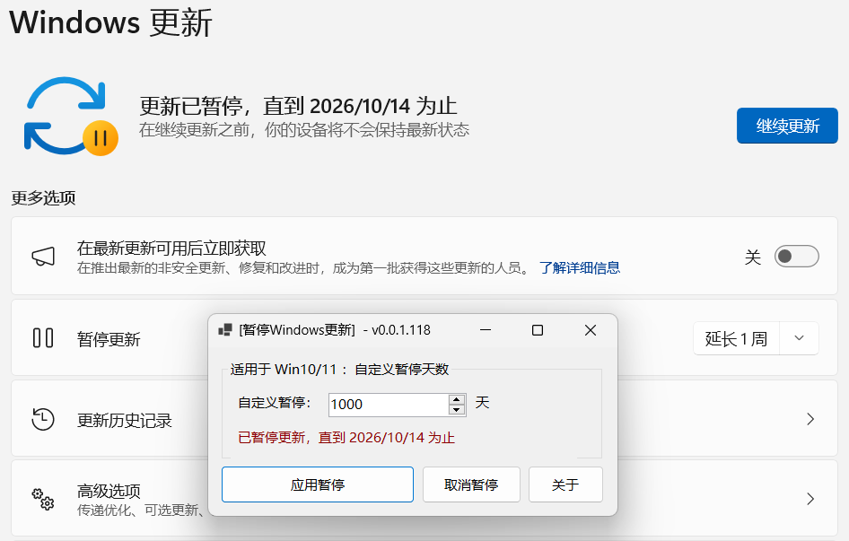
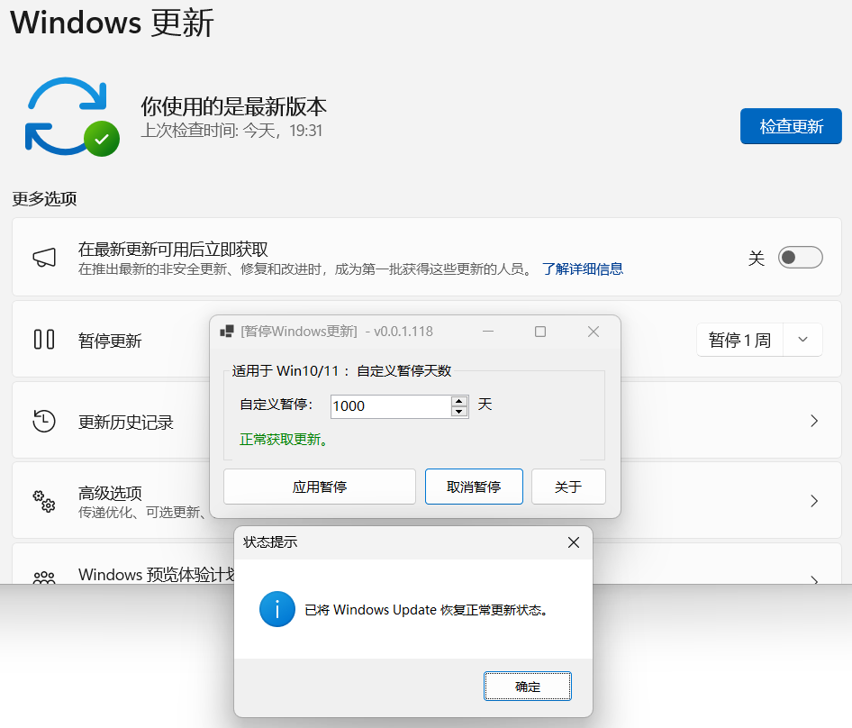
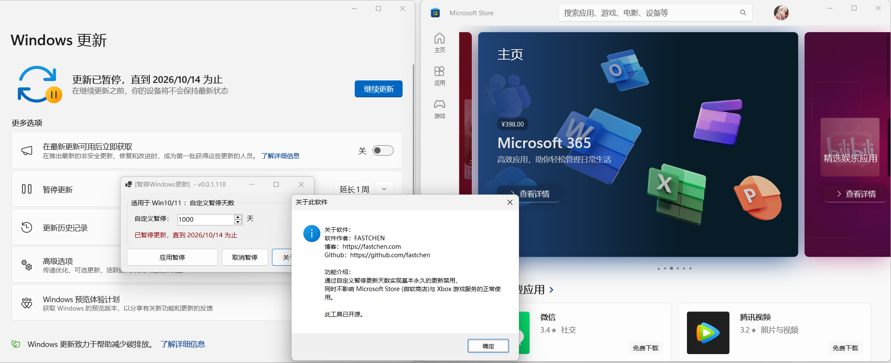

# 使用教学


若要使用此软件，请先下载安装对应系统位数的 .NET 8。

如未安装再打开软件时会弹出下载窗口，点击下载安装即可。

若已安装请忽略此信息。


运行软件，通过设置 自定义暂停天数 可以实现禁用更新。

<figure><figcaption></figcaption></figure>

设置天数后，点击 应用暂停 按钮，成功后则弹出通知。

<figure><figcaption></figcaption></figure>

设置后，可以前往 Windows 更新 页面查看是否与软件显示的一致。

<figure><figcaption></figcaption></figure>

如果想取得更新可以从**软件点击 取消暂停 按钮** 或从 **Windows 更新 页面中点击 继续更新 按钮** 即可恢复正常获取更新。

<figure><figcaption></figcaption></figure>

### 特别功能

此方法禁用更新不影响 **微软商店** 与 **Xbox游戏服务** 的正常使用。

<figure><figcaption></figcaption></figure>
