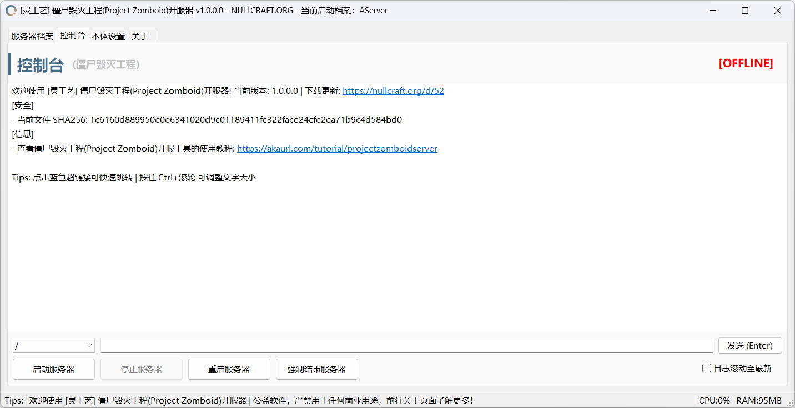

# 僵尸毁灭工程开服器

<pre class="language-csharp" data-title="Project Zomboid Server.sln"><code class="lang-csharp"><strong>Software software = new Software();
</strong>software.Name = "灵工艺僵尸毁灭工程开服器";
software.ProjectID = "NullCraft Project Zomboid Server";
software.Release = "https://nullcraft.org/d/114";
software.ReleaseDate = DateTime.Parse("2025,07,28").ToString();
software.Language = new string[] { "简体中文" };
software.Program = "C#";
software.Framework = ".NET 8";

NullCraftSoftwareList.add(software);

Trace.WriteLine(NullCraftSoftwareList.Items.Conut());

>>> 27
</code></pre>

## 关于《灵工艺僵尸毁灭工程开服器》

### 下载《灵工艺僵尸毁灭工程开服器》



### 软件介绍

一款由灵工艺发布快辰开发的僵尸毁灭工程游戏服务器管理工具。

### 使用教学


[project-zomboid-server.md](../../tutorial/project-zomboid-server.md)


### 软件图片

<figure><figcaption>
灵工艺僵尸毁灭工程开服器 | 服务器档案管理
</figcaption></figure>

<figure><figcaption>
灵工艺僵尸毁灭工程开服器 | 控制台
</figcaption></figure>

<figure><figcaption>
灵工艺僵尸毁灭工程开服器 | 本体设置
</figcaption></figure>

