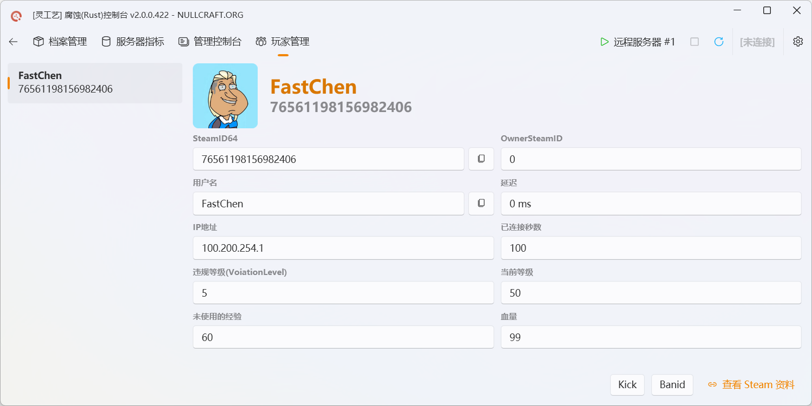

# 腐蚀控制台


```csharp
Software software = new Software();
software.Name = "灵工艺腐蚀(Rust)控制台";
software.ProjectID = "Rust Console";
software.Release = "https://nullcraft.org/d/24";
software.ReleaseDate = DateTime.Parse("2021,6,6").ToString();
software.Language = new string[] { "简体中文" };
software.Program = "C#";
software.Framework = ".NET8";

NullCraftSoftwareList.add(software);

Trace.WriteLine(NullCraftSoftwareList.Items.Conut());

>>> 8
```


## 关于《腐蚀控制台》

### 介绍《腐蚀控制台》

灵工艺腐蚀控制台(Rust Console) 是一款通过 `RCON` 技术远程管理游戏：腐蚀(Rust)专用服务器的软件。
\
通过此工具可以快捷管理服务器、查看服务器指标、管理服务器内的玩家等。

### 下载《腐蚀控制台》



### 使用教学

**若要使用此工具，需要将游戏专用服务器配置允许 RCON 连接：**

在 `server.cfg` 中填写如下配置：

```
# 本机的 IP 无需更改
rcon.ip 0.0.0.0
# 远程的端口 可自定义
rcon.port 25568
# 数值必须为 1
rcon.web 1
```

然后在你的启动脚本中设置远程密码：

```
# 密码要求(不然无法开启 RCON 功能)：至少8位并且有一定复杂度(大小写+数字+特殊字符)
+rcon.password "你的密码"
# 示例
RustDedicated.exe -batchmode +server.identity "rust_server" +rcon.password "你的密码" -logFile "output.txt" -autoupdate
```

### 更新日志

> 🧐 当发布新更新时，同时会在软件发布帖中以回复的形式发布更新的内容，当然你也可以前往下方的更新日志查看全部内容。


[update.md](update.md)


### 软件图片

<figure><figcaption><p>灵工艺腐蚀(Rust)控制台 | 档案管理</p></figcaption></figure>

<figure><figcaption><p>灵工艺腐蚀(Rust)控制台 | 服务器指标</p></figcaption></figure>

<figure><figcaption><p>灵工艺腐蚀(Rust)控制台 | 管理控制台</p></figcaption></figure>

<figure><figcaption><p>灵工艺腐蚀(Rust)控制台 | 玩家管理</p></figcaption></figure>

<figure><figcaption><p>灵工艺腐蚀(Rust)控制台 | 设置</p></figcaption></figure>
