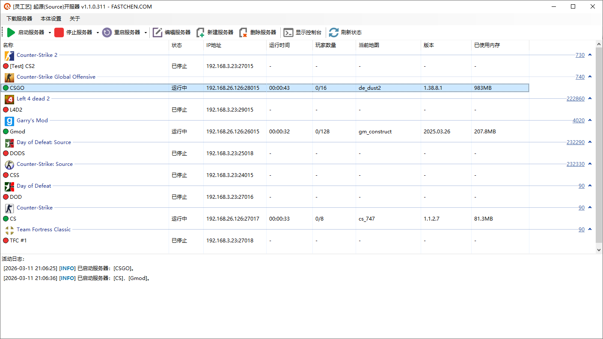
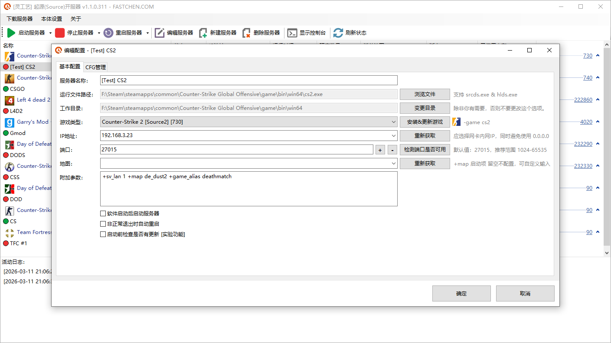
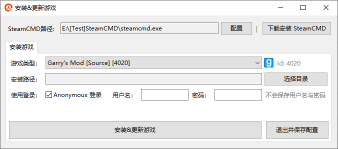

# 起源开服器


```csharp
Software software = new Software();
software.Name = "起源开服器";
software.ProjectId = "source-server";
software.Release = "https://nullcraft.org/d/117";
software.ReleaseDate = DateTime.Parse("2026,03,09").ToString();
software.Language = new string[] { "简体中文" };
software.Program = "C#";
software.Framework = ".NET 10";

```


### 关于《起源开服器》

#### 下载《起源开服器》



#### 软件介绍

灵工艺起源(Source)开服器是一款针对起源系列引擎游戏专用服务器(Source Dedicated Server)的集成管理工具，它可以轻松下载游戏服务器并进行管理，实现了从无到有的完整服务，工具介入方面小，即使新手与老手不再依赖本工具也不会失去对游戏服务器的数据配置等。

目前支持 **起源2引擎(Source2)**、**起源引擎(Source)**、**金源引擎(GoldSrc)** 的游戏服务器管理。

> 注：**起源2引擎(Source2)** 目前仅测试 **Counter-Strike 2** 并成功进入游戏。

**已支持的游戏信息：**

**起源2引擎(Source2)：**

* Counter-Strike 2

**起源引擎(Source)：**

* Counter-Strike Global Offensive
* Left 4 dead 2
* Left 4 dead
* Team Fortress 2
* Garry's Mod
* Day of Defeat: Source
* Half-Life 2
* Half-Life 2: Deathmatch

**金源引擎(GoldSrc)：**

* Counter-Strike: Condition Zero
* Day of Defeat
* Counter-Strike
* Team Fortress Classic
* Half-Life

#### 使用教学

* [【起源开服器】记录一下第一个预选版本的功能](https://www.bilibili.com/video/BV1teNczmEXQ)

#### 更新日志


[update.md](update.md)


#### 图片

<figure><figcaption><p>灵工艺起源开服器 | 主页</p></figcaption></figure>

<figure><figcaption><p>灵工艺起源开服器 | 服务器配置</p></figcaption></figure>

<figure><figcaption><p>灵工艺起源开服器 | 安装游戏服务器</p></figcaption></figure>
