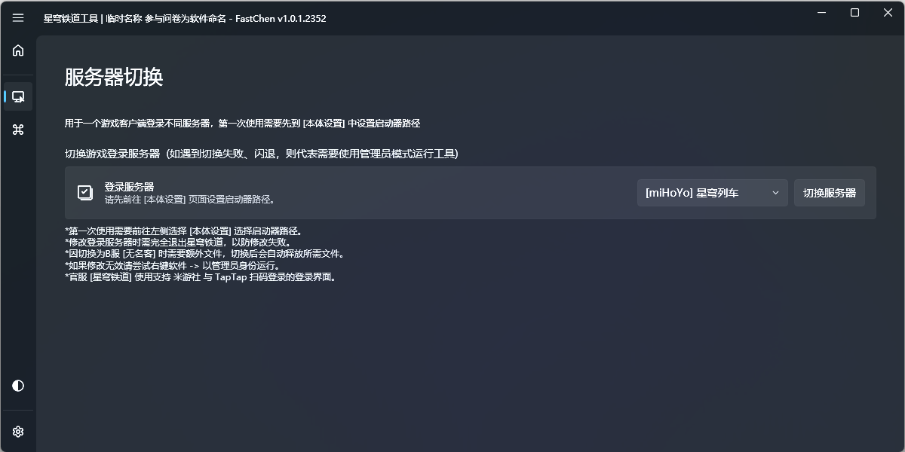

# 介绍


此工具由灵工艺验证发布，源安全、且开源。



发布与下载



开源地址


## 简介

### 什么是 星穹铁道工具？

此工具是为游戏《[星穹铁道](https://sr.mihoyo.com/)》进行制作的游戏体验加强工具。\
通常用来代替官方能制作但是没有做出来的功能和解锁官方自带的功能但是没有开启入口等的小工具。

### 为什么制作此工具？

制作此工具主要是基于已经制作的《[原神](https://ys.mihoyo.com/)》游戏工具 ——《提瓦特之匙》而拓展制作的功能，为了防止混用，特此独立开发，脱离之前框架进行使用。

## 功能

### 切换登录服务器

<figure><figcaption>
服务器切换页面截图
</figcaption></figure>

此功能主要是用于单个PC客户端登录到不同服务器，可以防止重复下载文件浪费硬盘空间，节省更新时间，防止多客户端注册表混乱等无法读取出来另一版本游戏等。

### 进阶启动

<figure><figcaption>
进阶启动页面截图
</figcaption></figure>

### 解锁 120 FPS

进阶启动可以解锁并调用官方的 120FPS 原生功能，此功能 目前[^1] 仅开放给苹果(iPhone、iPad)系列上。\
但是通过解锁 120FPS 功能，可以在PC上体验此功能。

### 修改游戏图像&音频设置

目前因为PC解锁 120FPS 后会导致游戏内的设置功能失效、损坏，特此在软件内实现启动游戏前自定义修改游戏配置的功能，其排序、设计逻辑、都与游戏相同并用图标标记增强。

### 设置窗口类型

此功能是通过《提瓦特之匙》复制而来，但经过测试，目前版本[^2] 游戏会自动覆盖非游戏内存在的分辨率比例，故此自定义长宽比功能暂时不可用，但，设置窗口类型为无边窗口化依旧可用。

### 本体设置

用于设置软件基础信息和外观(浅色、暗色)主题。

[^1]: 目前指游戏版本： 1.0版

[^2]: 目前指游戏版本： 1.0版

