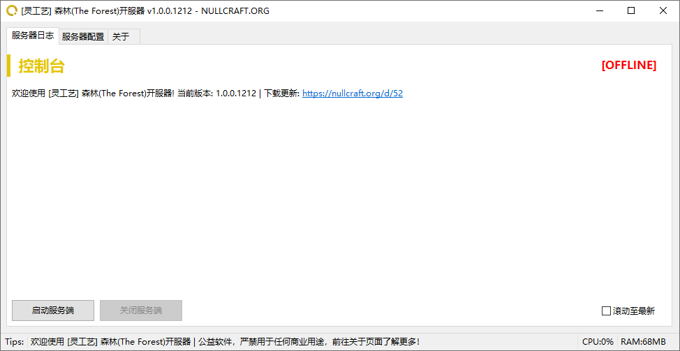
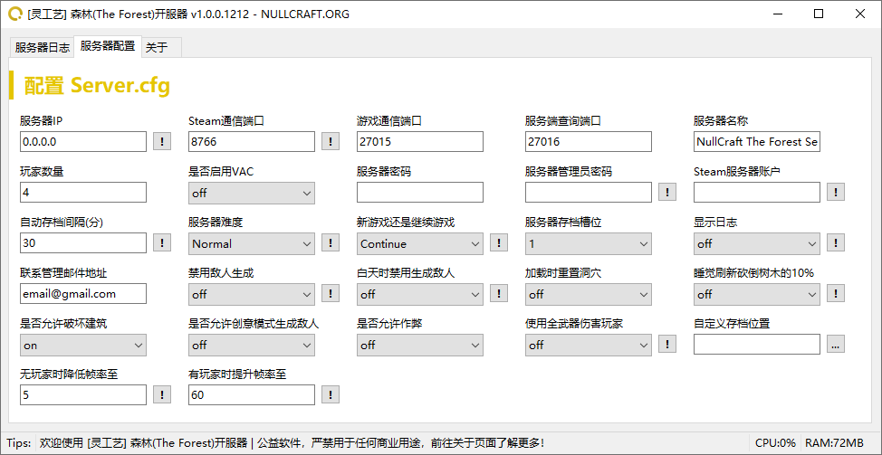

# 森林开服器


```csharp
Software software = new Software();
software.Name = "森林开服器";
software.ProjectID = "The Forest Server";
software.Release = "https://nullcraft.org/d/101";
software.ReleaseDate = DateTime.Parse("2024,12,12").ToString();
software.Language = new string[] { "简体中文" };
software.Program = "C#";
software.Framework = ".NET8";

NullCraftSoftwareList.add(software);

Trace.WriteLine(NullCraftSoftwareList.Items.Conut());

>>> 24
```


## 关于《森林开服器》 <a href="#guan-yu-mo-zu-jia-zai-qi-zhong-xin" id="guan-yu-mo-zu-jia-zai-qi-zhong-xin"></a>

### 下载《森林开服器》 <a href="#xia-zai-mo-zu-jia-zai-qi-zhong-xin" id="xia-zai-mo-zu-jia-zai-qi-zhong-xin"></a>



### 软件介绍 <a href="#jie-shao-yu-shi-yong" id="jie-shao-yu-shi-yong"></a>

一款灵工艺风格的游戏：森林(The Forest)开服工具。

### 更新日志 <a href="#geng-xin-ri-zhi" id="geng-xin-ri-zhi"></a>


[update.md](update.md)



### 软件图片 <a href="#ruan-jian-tu-pian" id="ruan-jian-tu-pian"></a>

<figure><figcaption><p>[灵工艺] 森林(The Forest)开服器 | 主页面</p></figcaption></figure>

<figure><figcaption><p>[灵工艺] 森林(The Forest)开服器 | 配置页面</p></figcaption></figure>
