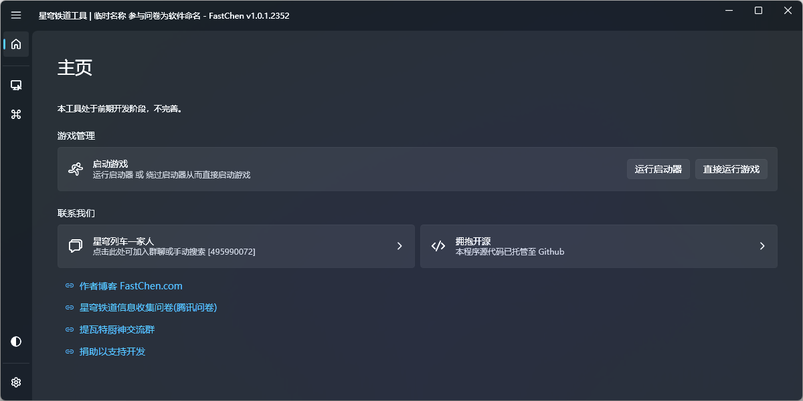
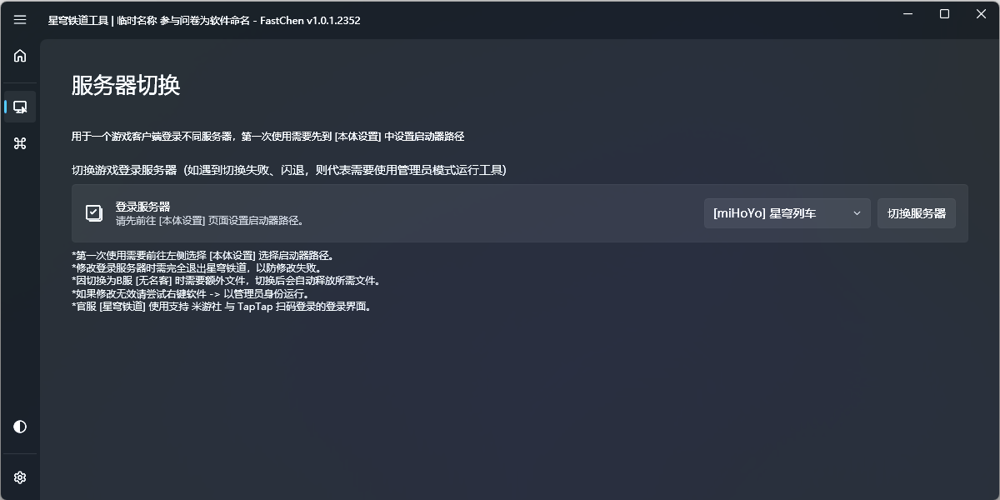
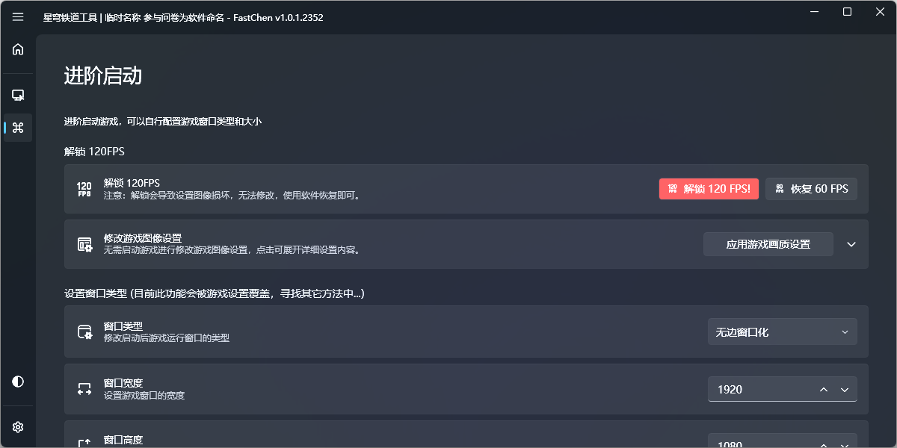
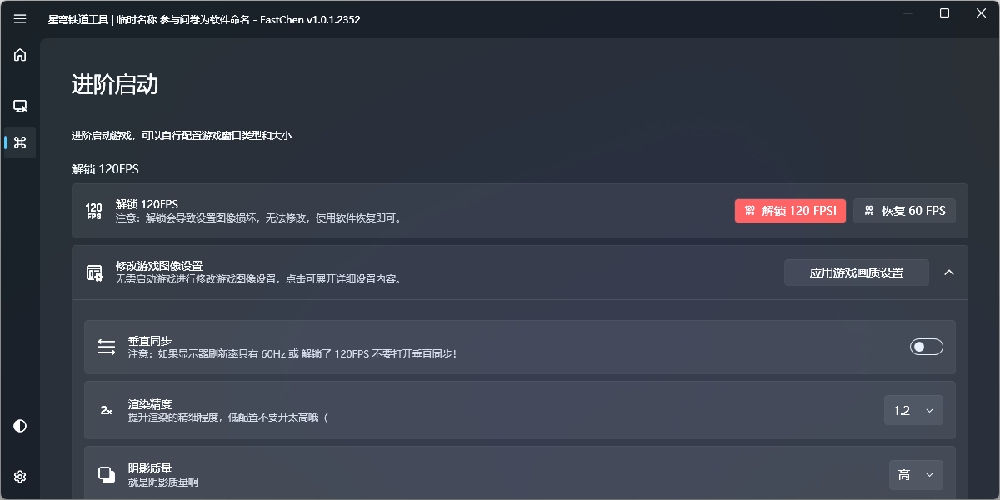

# 星穹之匙


此工具已正式命名为：**星穹之匙** / **The key of Star Rail**



此工具已正式发布。



```csharp
Software software = new Software();
software.Name = "星穹之匙";
software.ProjectID = "Star Rail Tool";
software.Release = "https://nullcraft.org/d/71";
software.ReleaseDate = DateTime.Parse("2023,4,26").ToString();
software.Language = new string[] { "简体中文" };
software.Program = "C#";
software.Framework = ".NET7";
software.Github = "https://github.com/FastChen/Star-Rail-Tool";

NullCraftSoftwareList.add(software);

Trace.WriteLine(NullCraftSoftwareList.Items.Conut());

>>> 16
```


### 关于《星穹之匙》

#### 下载《星穹之匙》



#### 如果你想看软件详细介绍


[introduction.md](introduction.md)


#### 如果你需要获取使用教学


[tutorial.md](tutorial.md)


#### 如果你想知道最近更新了什么


[update.md](update.md)


### 版权声明

本工具版权归属开发者：快辰，由灵工艺发布，其他人不得使用本软件用于商业用途或声称这是你开发的软件。

### 开源协议声明

本工具已开放源代码，并托管至 Github ，使用 [GNU General Public License v3.0](https://github.com/FastChen/Star-Rail-Tool/blob/master/LICENSE) 许可，对于源码的使用，请遵守协议许可的范围内使用。

### 对于本程序特别声明

本程序为游戏第三方增强工具，不含任何反编译、注入、破解、内存修改、文件修改、等操作，不存在违反用户协议，均使用游戏或游戏引擎自支持的功能实现，理论上不会导致游戏封禁，但目前没有封禁先例，也没有游戏官方允许承诺，此工具本质处于灰色地带。


一但使用本程序的任意功能，则默认同意并自行承担未知风险，所造成的损失开发者与发布方不承担任何责任。


### 软件图片

<figure><figcaption><p>星穹之匙 - 主页</p></figcaption></figure>

<figure><figcaption><p>星穹之匙 - 服务器切换</p></figcaption></figure>

<figure><figcaption><p>星穹之匙 - 进阶启动</p></figcaption></figure>

<figure><figcaption><p>星穹之匙 - 进阶启动 (详细列表)</p></figcaption></figure>
