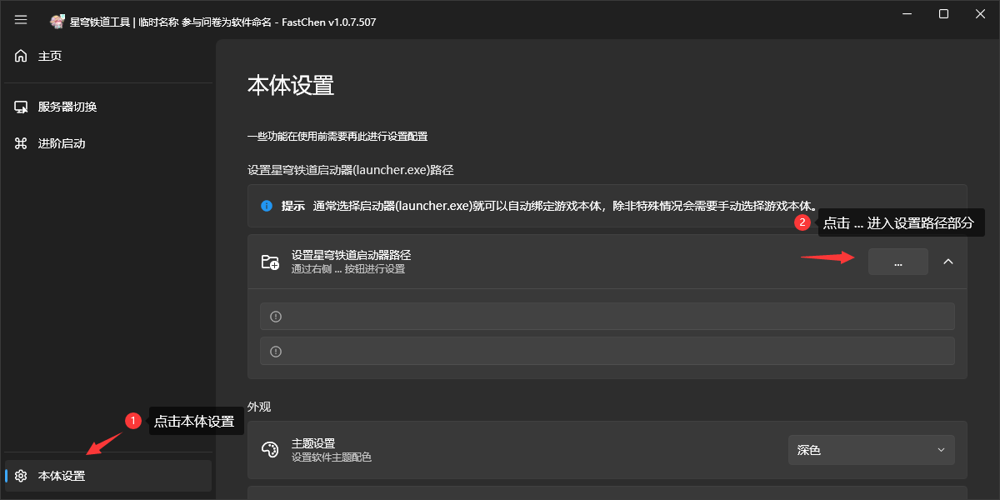
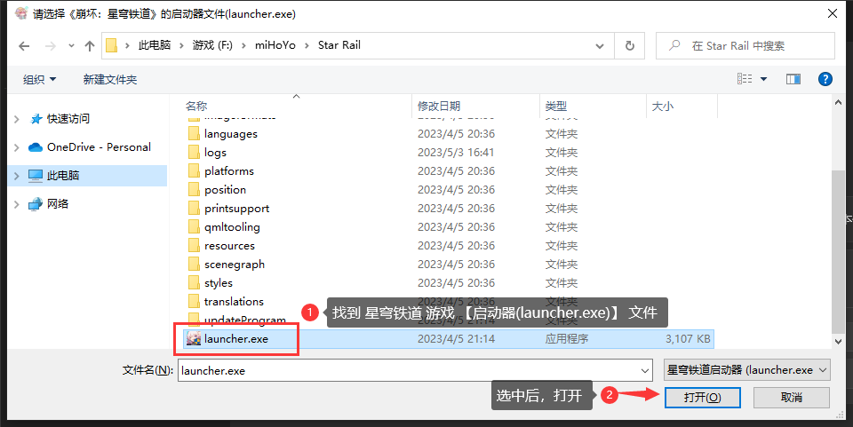
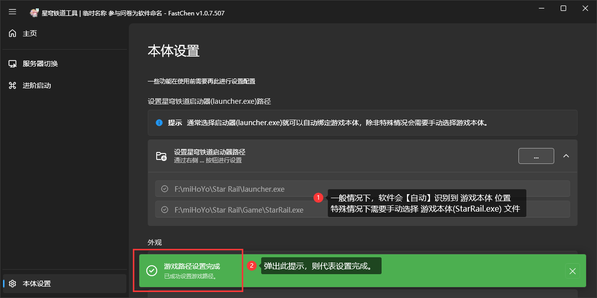
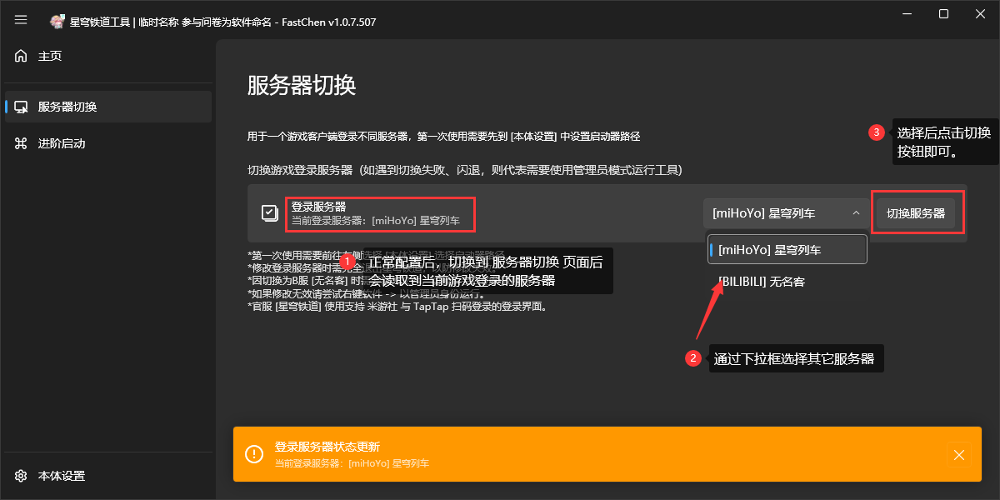
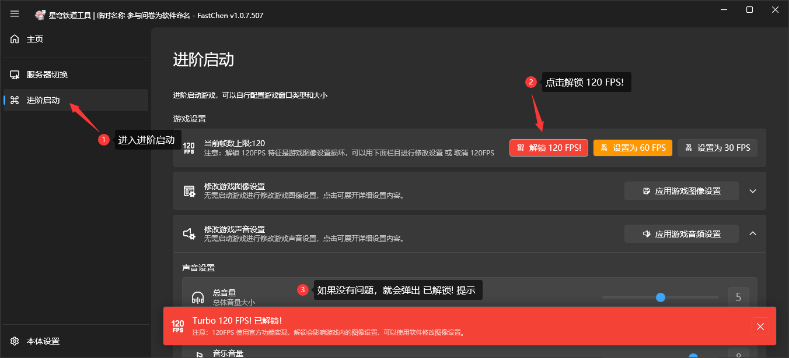

# 使用教学


如果你遇到了任何的错误弹窗，请点击此处的 [#extra](tutorial.md#extra "mention") 快速跳转到以便查看是否有解决方案，如果没有，你应当联系软件开发者详细描述问题，并附上截图。以便开发者快速解决问题。


## 基础配置

要正常使用《星穹铁道工具》时，需要对软件进行初始配置。

1. 点击 本体设置
2. 点击 ... 按钮打开选择文件页面

<figure><figcaption></figcaption></figure>

3. 找到你的 星穹铁道 启动器目录，注意是启动器，而不是游戏哦！

<figure><figcaption></figcaption></figure>

看见此状态即代表路径设置完毕。

<figure><figcaption></figcaption></figure>

## 修改登录服务器

做完上面的基础配置后，切换到 服务器切换 页面，通过下拉框选择想要登录的服务器，然后点击 切换服务器 按钮。提示切换成功，则可启动游戏登录到对应的服务器。

<figure><figcaption></figcaption></figure>

## 解锁 120FPS

1. 进入进阶启动页面
2. 点击解锁 120FPS 按钮
3. 软件提示已解锁后，登录游戏即可。


帧数解锁一次后如果不修改游戏配置理论上可一直使用。


<figure><figcaption></figcaption></figure>

## 额外问题解决 

### 运行软件弹出错误 / 无法打开软件

如果你遇到的下面这个样子的弹窗，这说明你的系统里没有安装软件运行需要的前置支持库，点击 是 按钮会自动下载一个文件，下载完毕后安装它，然后重新运行软件即可正常打开。

如果你遇到是不是下面这张图样子的，请截图并反馈至开发者。

<figure><figcaption></figcaption></figure>

### 需要管理员权限

出现此提示则代表，需要以管理员身份运行此工具。

管理员身份运行方法：右键软件-属性-兼容性-以管理模式运行 | [文图教学](https://jingyan.baidu.com/article/19020a0a1d9d4a139c28427e.html)—引用于百度经验

<figure><figcaption></figcaption></figure>

