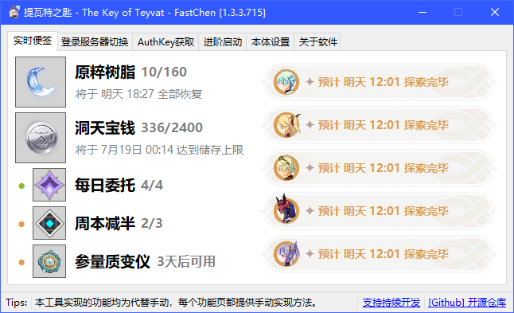
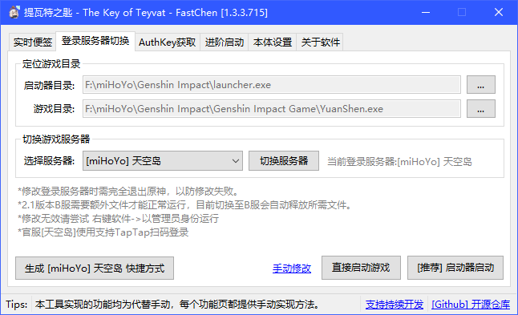
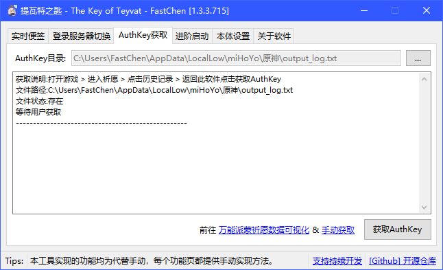
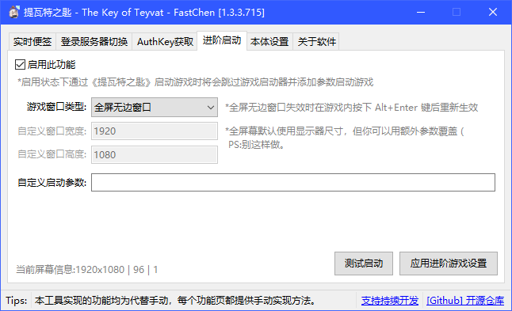

# 提瓦特之匙


此工具由灵工艺验证发布，源安全、且开源。


## 开源信息

 [](https://github.com/FastChen/The-Key-of-Teyvat/issues) 




```csharp
Software software = new Software();
software.Name = "提瓦特之匙";
software.ProjectID = "The Key of Teyvat";
software.Release = "https://nullcraft.org/d/71";
software.ReleaseDate = DateTime.Parse("2021,02,22").ToString();
software.Language = new string[] { "简体中文" };
software.Program = "C#";
software.Framework = ".NET4.6";
software.Github = "https://github.com/FastChen/The-Key-of-Teyvat";

NullCraftSoftwareList.add(software);

Console.WriteLine(NullCraftSoftwareList.Items.Conut());

>>> 15
```


## 关于《提瓦特之匙》

### 下载《提瓦特之匙》



### 如果你想知道最近更新了什么


[update.md](update.md)


## 版权声明

本工具版权归属开发者：快辰，由灵工艺发布，其他人不得使用本软件用于商业用途或声称这是你开发的软件。

## 开源协议声明

本工具已开放源代码，并托管至 Github ，使用 [GNU General Public License v3.0](https://github.com/FastChen/The-Key-of-Teyvat/blob/master/LICENSE) 许可，对于源码的使用，请遵守协议许可的范围内使用。

## 对于本程序特别声明

本程序为游戏第三方增强工具，不含任何反编译、注入、破解、内存修改、文件修改、等操作，不存在违反用户协议，均使用游戏或游戏引擎自支持的功能实现，理论上不会导致游戏封禁，但目前没有封禁先例，也没有游戏官方允许承诺，此工具本质处于灰色地带。


一但使用本程序的任意功能，则默认同意并自行承担未知风险，所造成的损失开发者与发布方不承担任何责任。


### 软件图片

<figure><figcaption><p>提瓦特之匙 - 实时便签</p></figcaption></figure>

<figure><figcaption><p>提瓦特之匙 - 登录服务器切换</p></figcaption></figure>

<figure><figcaption><p>提瓦特之匙 - AuthKey 获取</p></figcaption></figure>

<figure><figcaption><p>提瓦特之匙 - 进阶启动</p></figcaption></figure>
