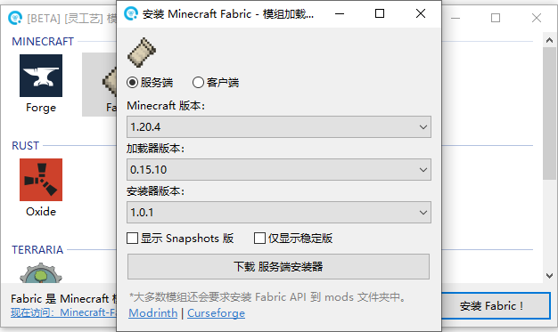

# Fabric


此模组加载器已考虑对其支持自动安装功能。


### 安装服务端

1. 通过使用《[^1][模组加载器中心](../../../software/modloader-center/)》下载或[自行下载](https://fabricmc.net/use/server/) Fabric Minecraft Server Launcher(服务端启动器) 文件

<figure><figcaption></figcaption></figure>


如果使用《[^2][模组加载器中心](../../../software/modloader-center/)》下载服务端后，将会弹出使用教学


<figure><figcaption></figcaption></figure>

3. 通过使用《[我的世界开服器](../../../software/minecraft-server/)》或 Bash 命令行/脚本启动服务端

```bash
// 启动命令行
java 可选参数 -jar 服务端启动器.jar nogui

// 完整实例
java -Xmx2G -jar fabric-server-mc.1.20.4-loader.0.15.10-launcher.1.0.1.jar nogui
```

### 安装客户端

1. 通过使用《[^3][模组加载器中心](../../../software/modloader-center/)》下载或[自行下载](https://fabricmc.net/use/installer/) Fabric Installer(安装器) 文件

<figure><figcaption></figcaption></figure>

2. 运行下载的 Fabric Installer 文件

<figure><figcaption></figcaption></figure>

3. 选择游戏版本后，指定安装位置(.minecraft文件夹)即可安装


Fabric 官方推荐使用此文档上方的 [#an-zhuang-fu-wu-duan](fabric.md#an-zhuang-fu-wu-duan "mention") 进行安装使用。


[^1]: 

[^2]: 

[^3]: 
