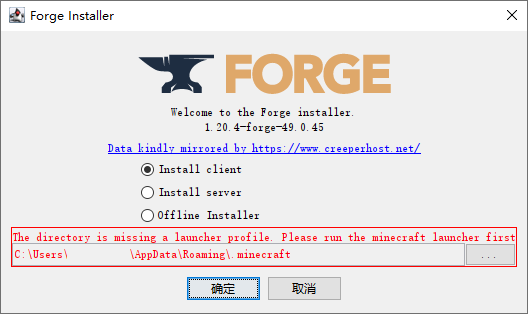
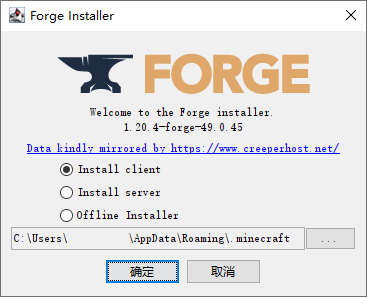

# Forge


此模组加载器已考虑对其支持自动安装功能。


1. 通过使用《[模组加载器中心](../../../software/modloader-center/)》下载或[自行下载](https://files.minecraftforge.net/) Forge Installer(安装器) 文件

<figure><figcaption>
模组加载器中心 | 下载 Minecraft Forge
</figcaption></figure>

2. 运行 Forge Installer(安装器) 文件


如打开路径提示红色，则代表安装目录缺少配置，需手动选择正确的 .minecraft 文件夹


<figure><figcaption>
Forge Installer 主界面 | 路径错误
</figcaption></figure>

<figure><figcaption>
可正常安装的界面
</figcaption></figure>

3. 通常安装器会选择官方 Minecraft 启动器的路径，也可以点击 ... 按钮指定目录
   1. 自定义路径只需要选择 **.minecraft** 目录即可。
   2. 三个选项分别是(从上到下) 安装客户端、安装服务端、离线安装器
   3. 部分网络下载可能失败
