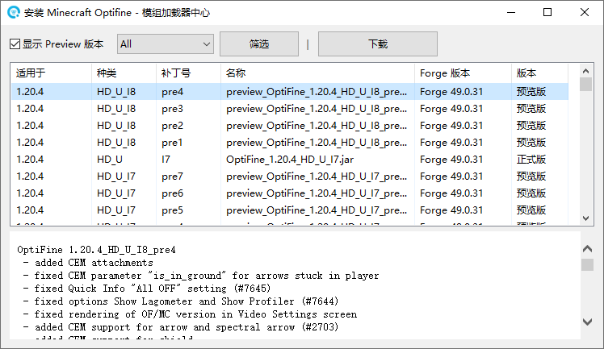
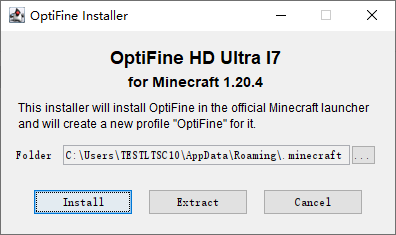

# Optifine


此模组加载器已考虑对其支持自动安装功能。


1. 通过使用《[模组加载器中心](https://docs.nullcraft.org/software/modloader-center)》下载或[自行下载](https://optifine.net/downloads) Optifine Installer(安装器) 文件

<figure><figcaption></figcaption></figure>

2. 选择游戏版本后，指定安装位置(.minecraft文件夹)即可安装

<figure><figcaption></figcaption></figure>
