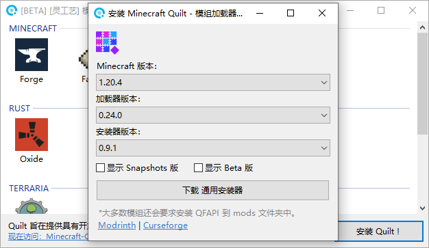
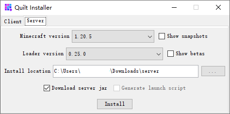

# Quilt


此模组加载器已考虑对其支持自动安装功能。


1. 通过使用《[模组加载器中心](https://docs.nullcraft.org/software/modloader-center)》下载或[自行下载](https://quiltmc.org/) Quilt Installer(安装器) 文件

<figure><figcaption></figcaption></figure>

2. 运行 Quilt Installer(安装器) 文件
   1. 选择要安装的版本然后选择对应的 .minecraft 路径

<figure><figcaption></figcaption></figure>

3. 如需安装服务端则使用 Server 页面
   1. 选择对应的游戏版本后，选择一个空文件夹后点击 Install 安装

<figure><figcaption></figcaption></figure>
