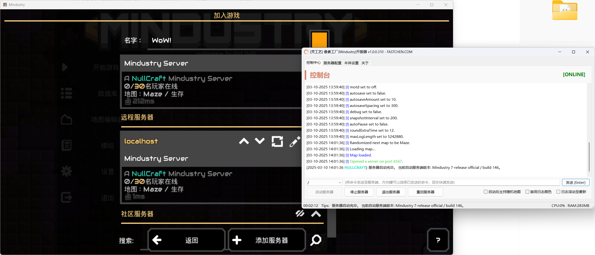

# 像素工厂(Mindustry)开服教程


注意

本教程面&#x5411;**《灵工艺像素工厂开服器》**&#x8F6F;件用户。 如果你不是使用此软件来开服，那么本教程的内容可能不适用于你。


## 开始

### 准备必要内容

#### 下载官方服务端

前往作者代码仓库下载服务端程序 `server-release.jar` 文件



#### 下载灵工艺像素工厂开服工具

前往灵工艺官方发布页面可以下载开服工具

> soon

### 开始部署服务器



### 运行《灵工艺像素工厂开服器》

<figure><figcaption></figcaption></figure>



### 进入本体设置导入服务端

<figure><figcaption></figcaption></figure>

<figure><figcaption></figcaption></figure>



### 配置服务端与Java环境

<figure><figcaption></figcaption></figure>



### 返回控制中心启动服务器

因服务端策略为启动与主持地图游戏，仅启动服务器未主持游戏时是不会在游戏内访问到的

启动服务器后可以输入 `host [地图名称] [游戏模式]` 的命令并主持游戏

<figure><figcaption></figcaption></figure>



### 启动并主持游戏后可在游戏本地服务器内显示并加入

<figure><figcaption></figcaption></figure>



### 参考内容

#### 官方维基



