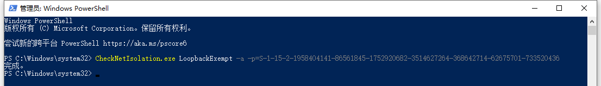

# 🛏 我的世界基岩版开服教程


**//TODO**

这是个临时教程，后续会跟随软件完善程度进行更新。


## 开始


本教程面向《灵工艺我的世界基岩开服器》软件用户。\
如果你不是使用此软件来开服，那么本教程的内容可能不适用于你。


### 查看视频版流程



### 查看文字版流程

## 准备必备文件

### 下载《灵工艺我的世界基岩开服器》



### 下载官方基岩版专属服务端软件(BDS)


**Tips:**

BDS 指：Bedrock dedicated server 即 基岩版专属服务端软件。


#### 下载当前最新版基岩版专用服务端

通过官方发布页，仅可以下载当前最新的正式版和预览版(Preview)服务端文件



1. 点击访问上方的链接卡片
2. 选择 "适用于 WINDOWS 的 MINECRAFT 专属服务端软件" 分区
3. 勾选 "✅ 我同意[ Minecraft 最终用户许可协议](https://minecraft.net/terms)和[隐私政策](https://go.microsoft.com/fwlink/?LinkId=521839)"
4. 点击 下载 按钮

#### 下载历史版本基岩版专用服务端

历史版本记录，可以下载到 1.6.1 (第一个基岩版专用服务端发布版本) 至 正式版游戏的最新版。

{% embed url="https://minecraft.fandom.com/zh/wiki/%E5%9F%BA%E5%B2%A9%E7%89%88%E4%B8%93%E7%94%A8%E6%9C%8D%E5%8A%A1%E5%99%A8#%E5%8E%86%E5%8F%B2" %}

1. 通过点击目录的 "历史" 选项快速跳转到历史列表。
2. 点击想要下载的 "蓝色版本" 即可打开对应的版本页面。
3. 查看打开的版本页面中的右侧表格，找到 "下载" 栏
4. 点击蓝色字体的 "Windows" 即可下载。


通过上方下载到的服务端会以 `bedrock-server-游戏版本.zip` 格式命名的 zip格式的压缩文件。


## 开启基岩服务器

### 安装服务器文件

1. 然后找一个地方，创建一个文件夹(不推荐桌面、C盘等)
2. 将《灵工艺我的世界基岩开服器》放入文件夹内并运行
3. 软件目录下出现 `bedrockserver` 文件夹，进入
4. 将 `bedrock-server-游戏版本.zip` 文件的全部文件解压到 `bedrockserver` 文件夹内
5. 到开服器 控制台 页面 点击 启动服务端 按钮
6. 等待启动完成。

### 本地(同一电脑下)测试进入服务器

1. 服务器启动后，打开对应版本的我的世界基岩版游戏
2. 进入游戏，点击 "服务器" 栏目
3. 然后点击 "添加服务器" 按钮
4. 在 "添加外部服务器" 窗口内按照下面提示输入信息
   1. 输入服务器名称，由你自己决定。
   2. 服务器地址填写：127.0.0.1 (代表本机地址)
   3. 端口输入：你设置的 IPv4 端口 (如果没改不用动，可以在 "开服器 > 服务端配置页面" 中修改)
5. 输入完毕后，点 "保存" 按钮，如果顺利的话会直接读取出来服务器信息，即可加入游戏。


如果上面的**信息确定没问题**，而且**服务器也是启动状态**，但是就是无法加载出来服务器信息，那么你需要设置一下回环解除。

[#jie-chu-hui-huan-xian-zhi](minecraft-bedrock-server.md#jie-chu-hui-huan-xian-zhi "mention")


## 错误解决

### 解除回环限制

1. 在 Windows 开始菜单或搜索栏中搜索 `powershell` ，然后以管理员身份启动。
2. 在 powershell 窗口中输入下方的代码。


```powershell
CheckNetIsolation.exe LoopbackExempt -a -p=S-1-15-2-1958404141-86561845-1752920682-3514627264-368642714-62675701-733520436
```


上面的代码输入后，powershell 会返回一句 `完成。` 然后重启服务器和游戏后再次尝试进入。如果还不行，则重新走一遍开服流程。

**示例图：**

<div data-full-width="false">

<figure><figcaption></figcaption></figure>

</div>
