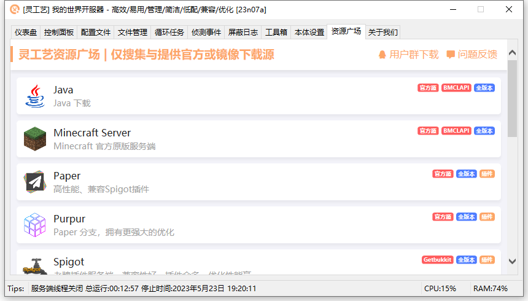

# 😇 我的世界Java版开服教程

## 开始


本教程面向《灵工艺我的世界开服器》软件用户。\
如果你不是使用此软件来开服，那么本教程的内容可能不适用于你。


## 必备文件

1. 最新版本的我的世界开服器 可在这里下载：[传送门](../software/minecraft-server/)
2. 准备开服需要对应版本的 Java (如果不知道需要版本在下方的 [#java-ban-ben-xuan-ze](minecraft-server.md#java-ban-ben-xuan-ze "mention") 查看)
3. 下载开服所需服务端 (服务端的具体选择在下方的 [#fu-wu-duan-de-xuan-ze](minecraft-server.md#fu-wu-duan-de-xuan-ze "mention") 查看)

## Java 版本选择

* 如果你要开最新版本的服务端，那么无脑选择最新版本的Java即可。
  * 官方最新版本下载地址：[Oracle](https://www.oracle.com/java/technologies/downloads/)
* 如果你要开的版本等于或高于 `1.18`
  * 那么你最低需要 Java 17 或更高版本：[Java 17 (Oracle)](https://www.oracle.com/java/technologies/downloads/#java17)、[OpenJDK 17(Microsoft)](https://learn.microsoft.com/zh-cn/java/openjdk/download#openjdk-17)
* 如果你要开的等于 `1.16`
  * 那么你最低需要 Java 16 或更高版本：[OpenJDK 16 (Adoptium)](https://adoptium.net/zh-CN/temurin/archive/?version=16)、[OpenJDK 16 (Microsoft)](https://learn.microsoft.com/zh-cn/java/openjdk/older-releases#openjdk-16)
* 如果你要开的等于 `1.15`
  * 那么你最低需要 Java 8 或更高版本：[Java 8 (MCRes)](https://mcres.net/download/java)、[OpenJDK 8 (Adoptium)](https://adoptium.net/zh-CN/temurin/archive/?version=8)

### Java 常用的下载地址：

* (Java) [Oracle](https://www.oracle.com/java/technologies/downloads/)
* (JDK) [jdk.java.net](https://jdk.java.net/)
* (OpenJDK) [Adoptium](https://adoptium.net/zh-CN/)、[Microsoft](https://learn.microsoft.com/zh-cn/java/openjdk/)


因 Oracle 官网老版本下载需要登录账户，所以部分仅提供最新版，或下载 OpenJDK


## 服务端的选择


在选择服务端之前，应该明确自己要开什么类型的服务端。


### 服务端不同类型的介绍

目前服务端分为四大类：

* 原版端
* 纯插件端
* 纯模组端
* 插件模组(混合端)

#### 对于原版：

就是 Minecraft 官方服务端，可以通过 FabricMC、Forge 安装模组 API 来支持对应 API 的模组。

#### 对于纯插件端：

主流以 Bukkit API 或 Spigot API(基于 Bukkit API 开发的 Minecraft 服务器插件应用程序编程接口)

#### 对于纯模组端：

纯模组端主要是由模组API制作而成的，例如 FabricMC、Forge、Sponge(特例)

#### 对于插件模组(混合端)：

插件模组端分为以 Bukkit API 或 Spigot API 加上 Forge API 制作而成的混合端。

#### 特例端

特例 Sponge 端：以 ForgeAPI 支持模组，以自己的插件格式(Sponge API)来加载插件。

### 下载服务端


你可以通过 《灵工艺我的世界开服器》内的资源广场页面下载服务端。

当然，你也可以手动访问下载：[灵工艺资源广场](https://mcres.net/)


<figure><figcaption></figcaption></figure>

## 开启服务器

### 步骤一 初次运行开服器

将上面所需的 [#bi-bei-wen-jian](minecraft-server.md#bi-bei-wen-jian "mention") 都准备好，然后找一个地方，创建一个文件夹(不推荐桌面、C盘等)，然后将开服器放入文件夹内，运行。

然后目录里就会生成一些文件。

* server 文件夹：用于存放服务端核心和服务器内容。
* config.ini 文件：开服器的配置文件。

<figure><figcaption></figcaption></figure>

### 步骤二 安装服务端

将下载的 `服务端.jar` 文件放到开服器目录下的 server 文件夹内，如图下所示。

<figure><figcaption></figcaption></figure>

放入后，回到开服器，打开 **本体设置** 页面，在 **服务端核心** 板块内，选择刚才放入的 `服务端.jar` 文件做为服务端启动文件。

<figure><figcaption></figcaption></figure>

然后根据你的服务端版本，在 **调用 Java** 板块内选择对应版本的 Java。

<figure><figcaption></figcaption></figure>

### 步骤三 开启服务器

将开服器页面选择到 **控制面板** 然后点击 **启动服务端** 按钮，等待服务端加载。

<figure><figcaption></figcaption></figure>


开服必然会遇到需要同意 Mojang 的 EULA(准则)，这里明确了服务器的使用规范。包括了不能出现的内容，如果你要对外公开服务器，请务必查看此协议，以防出现纠纷。

[查看 EULA](https://aka.ms/MinecraftEULA)


<figure><figcaption></figcaption></figure>

点击 是 软件可以帮你快捷同意，但是，如果你违反了 Mojang 的准则而被限制或收到诉讼，与本程序无关，本程序已对用户进行了置顶弹窗中英双语提示。

当控制台显示 服务端启动完成 等字样，说明你的服务器就已经开启了。

<figure><figcaption></figcaption></figure>

### 步骤四 进入服务器

打开对应版本的 Minecraft 游戏


注意：如果你开启的是支持模组的服务端，那么你需要使用同模组版本的客户端进入。


打开多人游戏，如果服务器是在你当前电脑上开启的，输入 `127.0.0.1` 进入服务器

如果不是本机开启的，那么输入机器对应的 IP地址即可。

<figure><figcaption></figcaption></figure>

完成后，列表就会读取到服务器信息

<figure><figcaption></figcaption></figure>

进入服务器，控制台同步出现玩家加入信息，完成。

<figure><figcaption></figcaption></figure>

## 额外内容

### 内网穿透

非灵工艺软件负责内容，等待更新。
