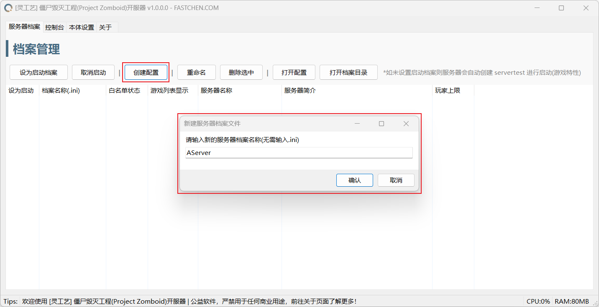
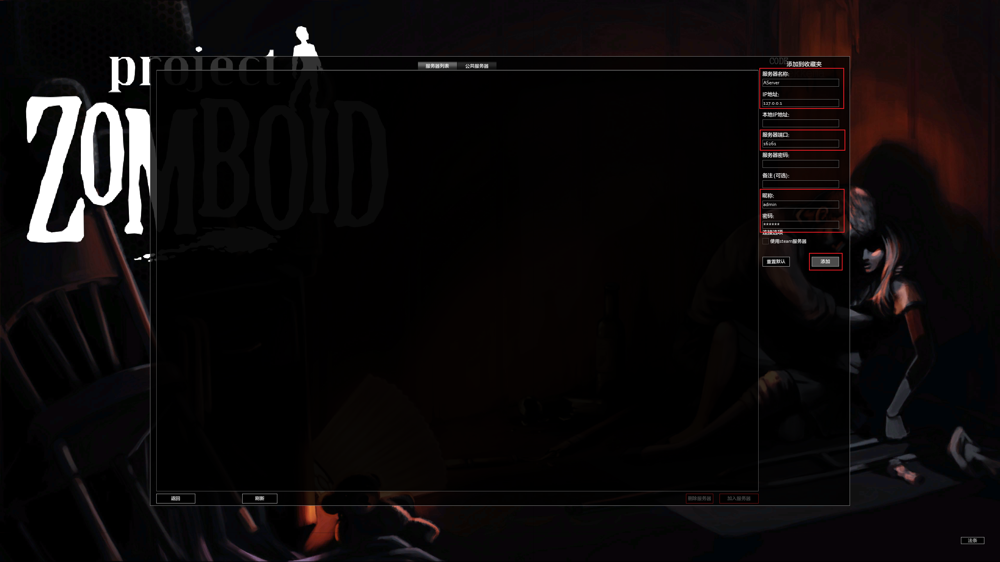

# 🧟 僵尸毁灭工程开服教程


本教程面向《灵工艺僵尸毁灭工程开服器》软件用户。
\
如果你不是使用此软件来开服，那么本教程的内容可能不适用于你。


## 设置专用服务器

### 下载僵尸毁灭工程专用服务器

打开 Steam 进入 库 页面，更改显示的类型，勾选工具以便显示专用服务器下载。


也可以使用 SteamCMD 下载，本文暂时以 Steam 客户端进行教学。


<figure><figcaption></figcaption></figure>

### 打开专用服务器目录

下载完毕后，右键 Project Zomboid Dedicated Server 打开文件所在目录。

<figure><figcaption></figcaption></figure>

### 放入开服工具至专用服务器目录内

将《灵工艺僵尸毁灭工程开服器》放入打开的专用服务器目录内并启动。


如忽略此步骤，则需前往开服器的本体设置页面手动选择并设置专用服务器目录。


<figure><figcaption></figcaption></figure>

## 创建并管理服务器

### 新建档案

打开《灵工艺僵尸毁灭工程开服器》，在档案管理页面新建一个服务器档案。


如先前在游戏内建立过服务器，则会在此列表中显示并可用(未改变服务器缓存目录情况下)。


<figure><figcaption></figcaption></figure>

### 设置启动档案

选中一个已存在的档案，点击 "设为启动档案" 按钮或勾选列表前勾选框即可将此档案设置为开服启动档案。

<figure><figcaption></figcaption></figure>

### 设置服务器管理员密码(初次)

当服务器第一次启动时，会要求设置管理员账户(admin)登录密码，以此身份登录服务器可以进行管理。

<figure><figcaption></figcaption></figure>

设置密码后要求再次重复输入之前设置的密码。

<figure><figcaption></figcaption></figure>

### 服务器启动中

<figure><figcaption></figcaption></figure>

### 服务器启动完毕

当看到控制台内 `*** SERVER STARTED ***` 或由开服工具提示的 `服务器启动完毕` 则代表专用服务器已启动完毕。

<figure><figcaption></figcaption></figure>

## 游戏内连接服务器

### 添加服务器

在加入游戏中的右侧的添加收藏夹中填写本地服务器信息。

* 服务器名称：自定义填写
* 服务器地址：本机则填写 127.0.0.1、公网则填写公网地址、内网穿透则填写穿透服务器地址。
* 服务器端口：未使用服务器穿透、转发则填写默认端口：`16261` 如使用或修改端口则填写对应端口。
* 昵称：自定义填写 或使用 admin 进行管理服务器。
* 密码：自定义填写

<figure><figcaption></figcaption></figure>

添加到列表后，点击刷新按钮后可以正常读取服务器信息。

<figure><figcaption></figcaption></figure>

加入服务器正常游玩。

<figure><figcaption></figcaption></figure>
