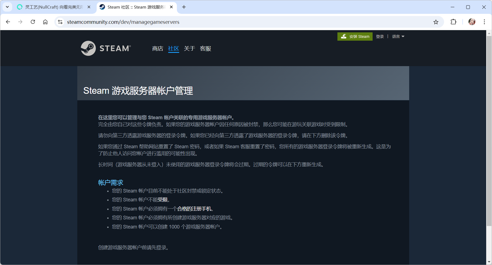
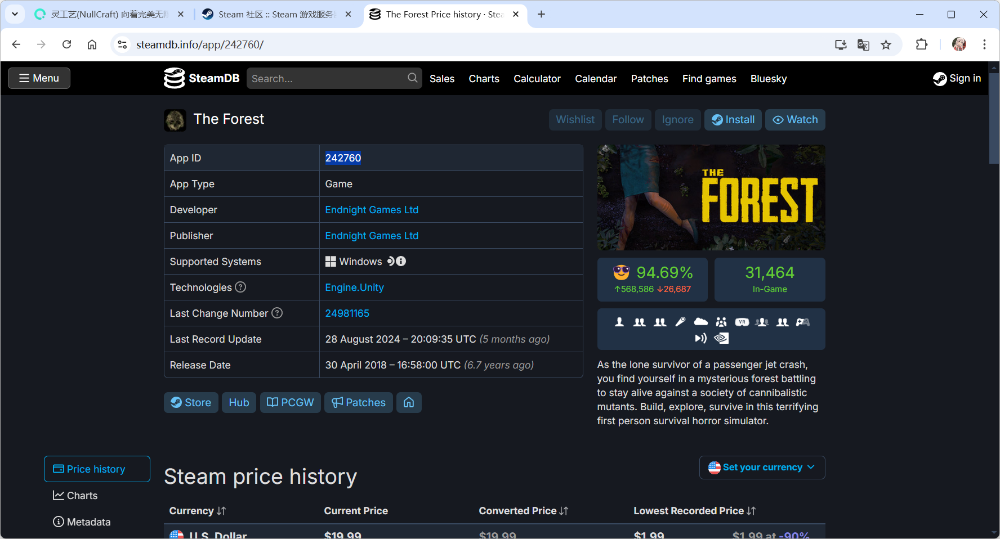
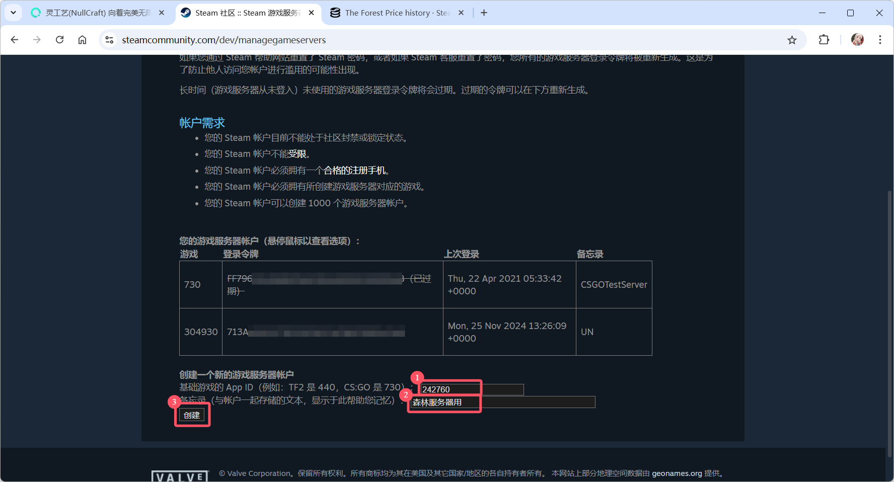
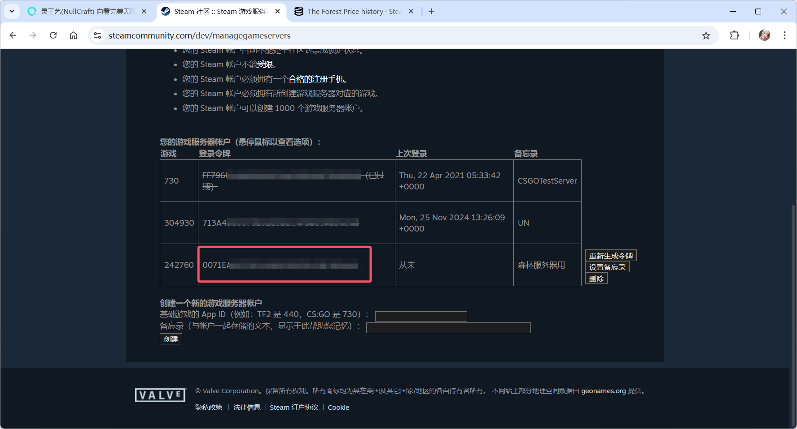
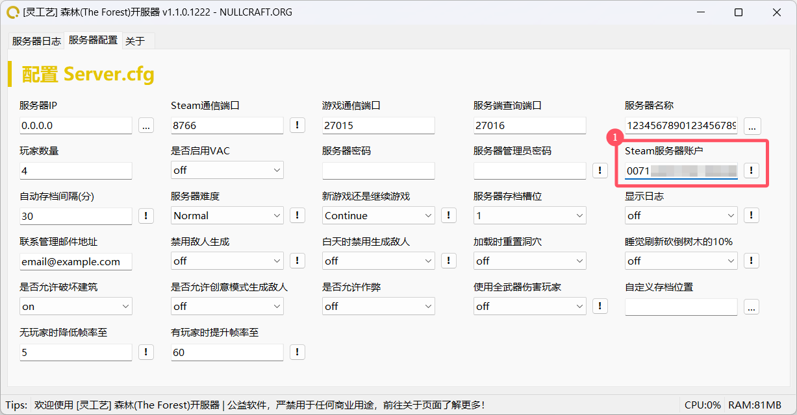

# 🎮 Steam 游戏服务器帐户管理


部分游戏需要一个验证过的令牌才能使用一些服务器上的功能，这通常是游戏开发者或Steam要求，这里以 The Forest(森林) 这款游戏作为教学指导。


## 注意事项


**注意:**

Steam 对此功能有部分限制


### 帐户需求

* 您的 Steam 帐户目前不能处于社区封禁或锁定状态。
* 您的 Steam 帐户不能[受限](https://support.steampowered.com/kb_article.php?ref=3330-IAGK-7663)。
* 您的 Steam 帐户必须拥有一个[合格的注册手机](https://support.steampowered.com/kb_article.php?ref=8625-WRAH-9030\&l=simplified%20chinese)。
* 您的 Steam 帐户必须拥有所创建游戏服务器对应的游戏。
* 您的 Steam 帐户可以创建 1000 个游戏服务器帐户。

### 令牌过期

* 长时间（游戏服务器从未登入）未使用的游戏服务器登录令牌将会过期。
* 过期的令牌可以在下方重新生成。

## 创建令牌

1. 登录 [Steam 游戏服务器账户管理](https://steamcommunity.com/dev/managegameservers)



<figure><figcaption></figcaption></figure>

2. 通过 SteamDB 查找 你要开启游戏服务器的 App ID



<figure><figcaption></figcaption></figure>

3. 登录账户后，从下方添加 App ID 和 备注
   1. 输入游戏的 App ID
   2. 输入备注
   3. 点击 创建 按钮

<figure><figcaption></figcaption></figure>

4. 填写后创建，会得到一串字符，这就是你的账户令牌

<figure><figcaption></figcaption></figure>

5. 在开服工具中的对应地方输入刚才获得的登录令牌并启动服务器测试

<figure><figcaption></figcaption></figure>
