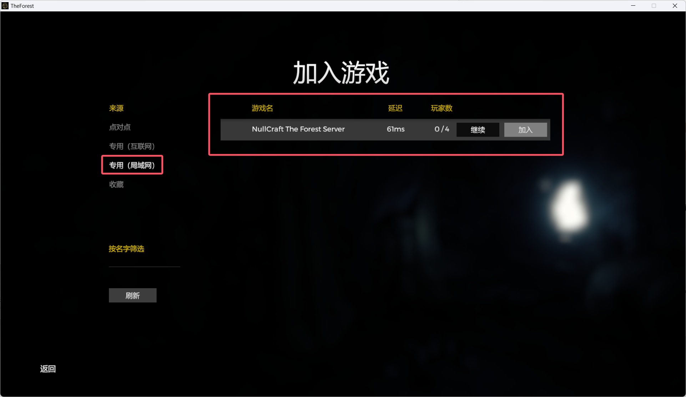

# 🌲 森林开服教程


**此教程正在持续更新中。**


## 开始 


本教程面&#x5411;**《灵工艺森林开服器》**&#x8F6F;件用户。 如果你不是使用此软件来开服，那么本教程的内容可能不适用于你。


### 下载官方专用服务器工具

1. 登录 Steam 在 **库** 中 **点击 游戏、软件和工具** 勾选 **工具** 选项。

<figure><figcaption></figcaption></figure>

2. 找到 **The Forest Dedicated Server** 并下载，下载完毕后打开文件目录。

<figure><figcaption></figcaption></figure>

### 运行服务器

1. 下载 **《灵工艺森林开服器》**



2. 将 **《灵工艺森林开服器》** 放入 **The Forest Dedicated Server.exe** 同级目录下。

<figure><figcaption></figcaption></figure>

3. 打开 **《灵工艺森林开服器》**  并运行服务器，直至等待提示 **服务器启动完毕**。

<figure><figcaption></figcaption></figure>

4. 打开游戏，测试局域网内是否能够正常显示服务器
   * 注：默认游戏名为 **NullCraft The Forest Server** 可在 **服务器配置** 页面进行修改。

<figure><figcaption></figcaption></figure>

## 问题排查

### 无法找到服务器

检查 服务器配置页面 中的 服务器IP地址 栏目，将此处的 IP 地址填写为本机 IPv4 地址或公网 IPv4 地址后再试
